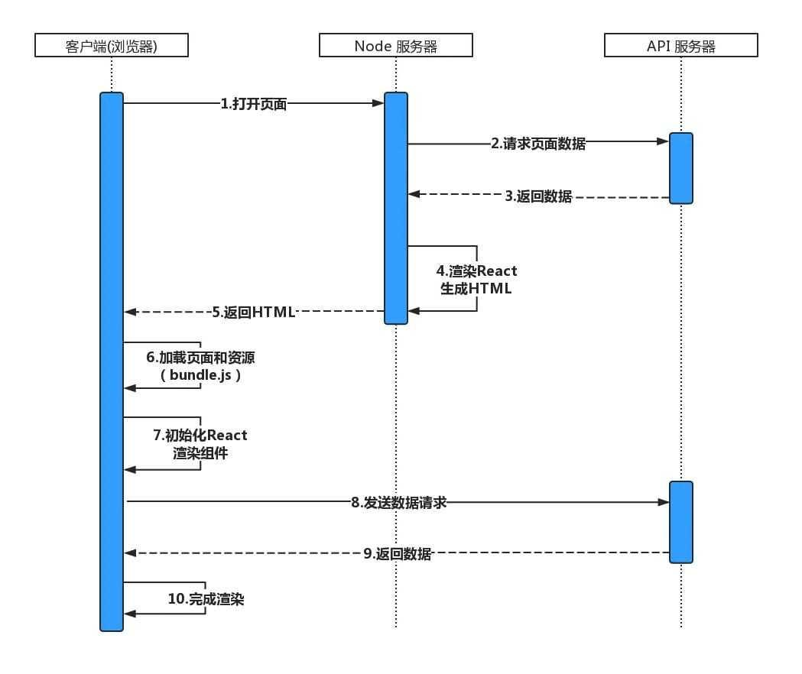
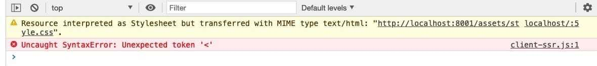

# react服务端渲染搭建（1）

## 前言

自前端框架（React,Vue,Angelar）出现以来，每个框架携带不同理念，分为三大阵营，以前使用JQuery的时代已经成为过去，以前每个页面就是一个HTML，引入相对应的JS、CSS，同时在HTML中书写DOM。正因为是这样，每次用户访问进来，由于HTML中有DOM的存在，给用户的感觉响应其实并不是很慢。

但是自从使用了框架之后，无论是多少个页面，就是单独一个单页面，即SPA。HTML中所有的DOM元素，必须在客户端下载完js之后，通过调用执行React.render()才能够进行渲染，所以就有了很多网站上，一进来很长时间的loading动画。

为了解决这一并不是很友好的问题，社区上提出了很多方案，例如预渲染、SSR、同构。

## 服务端渲染（ssr) & 客户端渲染（csr)

* 服务端渲染：在服务端把你想要渲染的内容直接拼接成html字符串，然后返回给客户端渲染。
* 客户端渲染：在浏览器端加载解析html完成之后，再去执行js代码，由js代码把你想要渲染的内容插入到页面中。


服务端渲染和客户端渲染相比较，服务端渲染有利有弊，优点有如下：
```
（1）加快了首屏渲染的速度
（2）有利于seo优化，提高在搜索引擎中的排名。
```
缺点：
```
（1）对开发者的要求更高，要了解服务端的知识。
（2）增加了开发运维的成本，服务器资源开销比较大。
```

所以，我们在开发中，到底要使用哪一种渲染方式，要根据具体的业务场景来订，不到万不得已，不要使用服务端渲染。

## 选择方案

1. 方案一 使用社区精选框架Next.js
Next.js 是一个轻量级的 React 服务端渲染应用框架。有兴趣的可以去Next.js官网学习下。

2. 方案二 同构 
webpack进行编译处理：使用webpack打包两份代码，一份用于Node进行服务器渲染，一份用于浏览器进行渲染。

下面具体详细说明下。

## 技术原理

以React为例，首先我们让React代码在服务端执行一次，使得用户下载的HTML已经包含了所有的页面展示内容（达到新增SEO的目的）。同时，用户不需要等到JavaScript代码全部执行完就可以看到页面效果，增强用户体验。之后，我们让React在客户端再次执行，为HTML页面中的内容添加数据及事件的绑定，页面就具备了React的各种交互能力。



### 核心api
服务端：使用 ReactDOMServer.renderToString | ReactDOMServer.renderToNodeStream 生成HTML，并且在首次请求下发。

客户端：使用 ReactDOM.hydrate 根据服务端返回的HTML进行 hydrate 操作。React 会尝试在已有标记上绑定事件监听器(从服务端返回的HTMl是不带任何事件的)。


## 在SSR项目中渲染组件
技术栈： React + Koa2 + Webpack

### 使用koa搭建服务端环境
新建文件夹，并且初始化项目
```
mkdir ssr-demo && cd ssr-demo
npm init -y
```
安装Koa环境
```
cnpm install --save koa
```
在项目根目录创建app.js，监听8888端口，当请求根目录时，返回一些HTML
```js
// app.js
const Koa = require('koa');
const app = new Koa();

app.use(async (ctx) => {
  ctx.body = `
  <html>
     <head>
         <title>ssr demo</title>
     </head>
     <body>
        <div style="color: red"> Hello World </>
     </body>
  </html>
  `
})

app.listen(8888);
console.log('app is starting at port 8888');
```
在终端输入命令启动服务 node app.js

### 在服务端编写React代码
我们已经启动了一个Node服务器，下一步我们需要在服务器上编写React代码(也可以是Vue或者是其他框架语言)，我们创建一个React组件，并且在App中返回。

安装React环境，创建src/components文件夹，新建home.js文件
```
cnpm install --save-dev React

mkdir src && cd src && mkdir components && cd components && touch home.js
```

编写一个最简单的React组件
```js
import React from 'react'

const home = () => {
  return <div> This is a React Component</div>
}

export default home;
```

并且在app.js中引用
```js
const Koa = require('koa');
const React = require('react');
const { renderToString } = require('react-dom/server');
const Home = require('./src/components/home');
const app = new Koa();

app.use(async (ctx) => {
  ctx.body = renderToString(<Home />)
})

app.listen(8888);
console.log('app is starting at port 8888');
```

当前是在Node环境下，Node不能识别import和export。这二者属于ESM语法，而Node遵循的是common.js规范

Node不能识别JSX语法

为了使代码能够运行，我们需要安装webpack并进行配置, 根目录下创建配置文件webpack.server.js并进行相关配置
```js
const path = require('path')    //node的path模块
const nodeExternals = require('webpack-node-externals')

module.exports = {
    target:'node',
    mode:'development',           //开发模式
    entry:'./app.js',             //入口
    output: {                     //打包出口
        filename:'bundle.js',     //打包后的文件名
        path:path.resolve(__dirname,'build')    //存放到根目录的build文件夹
    },
    externals: [nodeExternals()],  //保持node中require的引用方式
    module: {
        rules: [{                  //打包规则
           test:   /\.js?$/,       //对所有js文件进行打包
           loader:'babel-loader',  //使用babel-loader进行打包
           exclude: /node_modules/,//不打包node_modules中的js文件
       }]
    }
}
```

在项目根目录上创建babel的配置文件 babel.config.js
```js
module.exports = function(api) {
  api.cache(true);
  return {
    presets: [
      ['@babel/preset-env', {
        targets: {
          node: true,
        },
        modules: 'commonjs',
        useBuiltIns: 'usage',
        corejs: { version: 3, proposals: true },
      }],
      '@babel/preset-react',
    ],
  }
}
```

### 同构的概念
通过上面的例子，我们已经能够将React组件渲染到页面。为了讲明白同构的概念，下面我们为组件绑定一个点击事件。
```js
import React from 'react';

const Home = () => {
  return <div> This is a React Component
    <button onClick={()=>{alert('click')}}>click</button>
  </div>
}

export default Home;
```
重新运行代码，刷新页面（由于我们的工程里没有集成热更新，所以每次修改还需要重启并且刷新页面）。我们会发现，点击按钮后onClick事件并不会执行。这是因为renderToString()方法只渲染了组件的内容，并不会绑定事件（DOM的宿主是浏览器）。

！！！因此我们需要将React代码在服务端执行一遍，在客户端再执行一遍，这种服务端和客户端公用一套代码的方式就称之为同构

### 在客户端执行React代码
React代码在服务端执行的时候只能返回HTML页面，但是不具备任何交互。需要我们将React代码在客户端重新再执行一遍，确保页面能响应onClick等事件。React提供了 hydrate 方法。
```js
// 为了能在客户端执行这段代码，我们需要在模板中手动引入该代码
ReactDOM.hydrate(element, container[, callback])
```

新建client-ssr.js
```js
import React from 'react'
import {hydrate} from 'react-dom'
import Home from './src/components/home'

hydrate(
   <Home />,
  document.getElementById('app')
)
```

新建template.js
```js
export default function template(content = '') {
	let page = `<!DOCTYPE html>
      <html lang="en">
      <head>
      <meta charset="utf-8">
      <link rel="icon" href="data:;base64,=">
      </head>
      <body>
      <div id="app">${content}</div>
      </body>
      <script src="/client.js"></script>`;
	return page;
}
```

修改app.js 将template的内容作为结果返回
```js
const Koa = require('koa');
const React = require('react');
const template = require('./template').default;
const { renderToString } = require('react-dom/server');
const Home = require('./src/components/home');
const app = new Koa();

app.use(async (ctx) => {
  ctx.body = rtemplate(renderToString(<Home />)) 
})

app.listen(8888);
console.log('app is starting at port 8888');
```

重启，发现报错了！



由于我们的client-ssr中是React的JSX语法，直接返回给浏览器是解析不了的，需要用babel解析成浏览器能识别的JavaScript。

需要webpack将jsx处理成浏览器认识的语言

新建webpack配置文件,另外我们需要安装babel-loader去解析我们的JSX语法
```js
const path = require('path');

module.exports = {
  mode: 'development',
  entry: {
    client: './client-ssr.js',
  },
  output: {
    path: path.resolve(__dirname, 'public'),
    filename: "[name].js"
  },
  module: {
    rules: [
      { test: /\.js$/, exclude: /node_modules/, loader: "babel-loader" }
    ]
 }
}
```
终端运行 npx webpack，打包client-ssr.js文件。


使用koa-static指定根目录
到目前为止，我们的文件已经准备好了。但是在访问的时候会发现，我们在template.js中的/client.js文件并没有拿到。所以我们需要告诉当前服务，项目的根目录在哪里，服务端才能正确返回我们需要的文件，这里使用 koa-static 中间件。

app.js 添加
```js
const koaStatic = require('koa-static');

app.use(koaStatic(path.resolve(__dirname, '../public')));
```

重新启动服务器，点击click按钮，成功了！再次在客户端渲染后，我们的页面能正常相应click事件了。

## 在SSR项目中使用路由 (路由同构)

### 在客户端中使用路由
在使用路由时，我们需要在服务端和客户都各配置一遍路由。首先我们安装react-router-dom

为了使得客户端和服务端的路由能够匹配，我们在src文件夹下创建router/index.js来存放公共的路由配置
```js
import React from 'react';
import { Route } from 'react-router-dom'
import Home from '../components/home'
import Login from '../components/Login'

export default (
  <div>
    <Route path="/" exact component={Home} />
    <Route path="/home" exact component={Home} />
    <Route path="/login" exact component={Login} />
  </div>
)
```

测试路由，在src/components下再创建一个Login组件
```js
import React from "react";

const Login = () => {
  return (
    <div>
      <div>
        <span>请输入账号</span>
        <input placeholder="请输入密码" />
      </div>
      <div>
        <span>请输入密码</span>
        <input placeholder="请输入密码" />
      </div>
    </div>
  );
};

export default Login;
```

然后在client-ssr.js中引入Route文件，并且采用BrowserRouter包起来
```js
import React from "react";
import { hydrate } from "react-dom";
import { BrowserRouter } from "react-router-dom";
import Router from './src/router'

hydrate(
  <BrowserRouter> {Router} </BrowserRouter>,
  document.getElementById("app")
);
```
运行 npx webpack命令 对client-srr.js进行编译

### 在服务端中使用路由

1. 用 StaticRouter 替代 BrowserRouter
在服务器端我们需要使用StaticRouter来替代BrowserRouter，StaticRouter 是 React-Router 针对服务器端渲染专门提供的一个路由组件，由于StaticRouter不能像BrowserRouter一样感知页面当前页面的url，所以我们需要给StaticRouter传入location={当前页面url}，另外使用  StaticRouter时必须传递一个context参数，用于服务端渲染时的参数传递。

2. 使用 koa-router 来控制服务端的请求路径

由于我们不确定用户在访问页面时候的初始路径是什么，所以干脆对所有的路径都进行接收，然后通过location传递到Route中进行匹配。

最终的app.js代码
```js
const Koa = require('koa');
const koaStatic = require('koa-static');
const path = require('path');
const template = require('./template').default;
const React = require('react');
const KoaRouter = require('koa-router');
const { renderToString } = require('react-dom/server');
const { StaticRouter } = require('react-router-dom');
const Router = require('../client/router').default;

const koaRouter = new KoaRouter();
const app = new Koa();

app.use(koaStatic(path.resolve(__dirname, '../public')));


koaRouter.get("/(.*)", async (ctx) => {
  const context = {};
  console.log('ctx.url', ctx.url);
  ctx.body = template(
    renderToString(
      //传入当前path
      //context为必填参数,用于服务端渲染参数传递
      <StaticRouter location={ctx.url} context={context}>
        {Router}
      </StaticRouter>
      // <Home />
    )
  );
});

app.use(koaRouter.routes());

app.listen(8888);
console.log('app is starting at port 8888');
```

运行node app.js, 在浏览器中分别输入http://localhost:8002/home和http://localhost:8002/login就能实现React路由功能。


## webpack自动打包和服务端自动重启
写到这里我们对之前的Node和webpack的启动方式做一个小优化，在这之前，我们每次对项目的改动，都需要重新执行webpack--config webpack.config.js和node app.js来重启项目，现在我们对package.json文件中的script做一些改动，使得服务器能够自动重启和打包

1. 在webpack --config webpack.server.js后加上—watch就能实现
2. 安装nodemon，nodemon是nodemonitor的缩写，nodemon能够帮我们监听文件的变化并自动重启服务器，我们需要运行 npm install nodemon –g安装nodemon，在package.json的script配置项中添加这两句

```js
"scripts":{
   "dev": "nodemon--watch build --exec node \"./build/bundle.js\"",
   "build": "webpack--config webpack.server.js --watch"
},
```

我们开启两个终端，分别运行npm run dev和npm run build就能完成项目的自动打包和服务器重启
3. 安装npm-run-all进一步简化流程
运行npm install npm-run-all –g安装npm-run-all，并对package.json进行配置
```js
"scripts": {
   "dev": "npm-run-all--parallel dev:**",
   "dev:start": "nodemon--watch build --exec node \"./build/bundle.js\"",
   "dev:build": "webpack--config webpack.server.js --watch"
},
```

## webpack优化整理
在项目中编写了两个webpack配置文件，其实在这两个配置文件当中存在很多共同的部分，我们应该将共同的部分提取出来，减少代码的冗余性。我们安装webpack-merge模块来帮助我们提取公用的webpack配置项。

贴出自己的github地址: https://github.com/liukexina/ssr

## 参考链接

[从零开始React服务器渲染（SSR）同构（基于Koa）](https://juejin.cn/post/6844903777766473742#heading-17)

