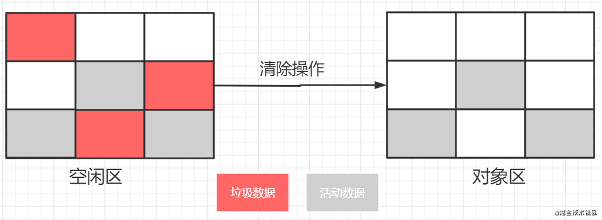

# js 引擎 v8 - 垃圾回收

## 引言

JavaScript 是一门具有自动垃圾收集机制的编程语言，由执行环境负责在代码执行时管理内存，当运行 javascript 时，你需要一个引擎来处理它，无论是在浏览器还是在 node.js 环境中， V8是你的选择之一，也一定是你的不二选择。下面我们就一起来看看V8是怎么进行高效的垃圾回收的吧。


## 垃圾回收算法

垃圾回收的实现简单分为以下三个步骤：

1. 从 GC Roots 对象出发，遍历 GC Root 中的所有对象：
    * 可访问对象：通过 GC Root 遍历到的对象，我们就认为该对象是可访问的（reachable），那么必须保证这些对象应该在内存中保留。
    * 不可访问对象：通过 GC Roots 没有遍历到的对象，则是不可访问的（unreachable），并会对其坐上标记，那么这些不可访问的对象就可能被回收。
2. 回收不可访问对象所占据的内存
    * 其实就是在所有的标记完成之后，统一清理内存中所有被标记为可回收的对象。
3. 内存整理
    * 频繁回收对象后，内存中就会存在大量不连续空间，称为内存碎片。当出现了大量的内存碎片之后，如果需要分配较大的连续内存时，就会出现内存不足的情况，所以最后一步需要整理这些内存碎片。但这步不是必须的，比如接下来我们要介绍的副垃圾回收器就不会产生内存碎片。

目前 V8 采用了两个垃圾回收器，主垃圾回收器和副垃圾回收器，下面我们再具体来看看两个回收器是怎么回收垃圾的。

## 副垃圾回收器和主垃圾回收器

在 V8 中，会把堆分为新生代（新生代通常只支持 1～8M 的容量）和老生代（容量大）两个区域，新生代中存放的是生存时间短的对象，老生代中存放生存时间久的对象。

### 副垃圾回收器

* 负责新生代的垃圾回收，大多数小的对象都会被分配到新生代，垃圾回收比较频繁。
* 新生代中的垃圾数据用 Scavenge 算法来处理。分为两个区域：对象区域 ，空闲区域。如下图所示：


* 垃圾回收过程：
```
新加入的对象都会存放到对象区域，当对象区域快被写满时，就需要执行一次垃圾清理操作。
```
   1. 垃圾标记和清理：首先要对对象区域中的垃圾做标记；标记完成之后，就进入垃圾清理阶段,如下图：


图中可以看到，副垃圾回收器会把这些我们仍然在用的对象复制到空闲区域中，同时它还会把这些对象有序地排列起来，在复制过程，相当于完成了内存整理操作，复制后空闲区域就没有内存碎片了。

   2. 角色翻转：完成复制后，进行角色翻转。把原来的对象区变成空闲区，把原来的空闲区变成对象区，如下图：


### 主垃圾回收器
* 负责老生代中的垃圾回收，大多数占用空间大、存活时间长的对象都会被分配到老生代里。

* 老生代中的垃圾数据用——标记 - 清除算法进行垃圾回收，因为老生代中的对象通常比较大，复制大对象非常耗时，会导致回收执行效率不高，所以采用标记清除法。

* 垃圾回收过程：
   1. 标记：标记阶段就是从一组根元素开始，递归遍历这组根元素，在这个遍历过程中，能到达的元素称为活动对象，没有到达的元素就可以判断为垃圾数据。
   2. 清除：它和副垃圾回收器的垃圾清除过程完全不同，主垃圾回收器会直接将标记为垃圾的数据清理掉，如下图：



   3. 整理：从上图可以看到，清除后会产生大量不连续的内存碎片，过多的碎片会导致大对象无法分配到足够的连续内存，于是需要引进另一种算法——标记 - 整理，整理过程如下图：


### 优化垃圾回收器
* 由于 JavaScript 是运行在主线程之上的，在垃圾回收时会阻塞 JavaScript 脚本的执行，会造成页面卡顿等问题，使得用户体验不佳。

* 为了解决上述问题，V8 团队推出了并行、并发和增量等垃圾回收技术，这些技术主要是从两方面来解决垃圾回收效率问题的：

    1. 将一个完整的垃圾回收的任务拆分成多个小的任务，解决单个垃圾回收时间长的问题。
    2. 将标记对象、移动对象等任务转移到后台线程进行，减少主阻塞线程的时间。
