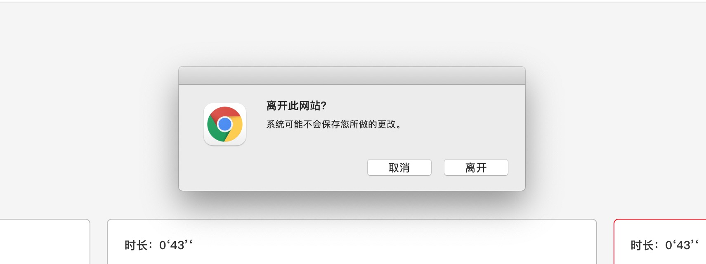

# onbeforeunload使用踩坑

## 引言
项目开发需要关闭标签页时，弹窗提示用户【数据将不被保存，是否继续操作】

实现该功能，则需要监听浏览器是否关闭
下面来学习涉及到浏览器关闭的两个方法onbeforeunload、onunload

## onbeforeunload、onunload
onunload，onbeforeunload都是在刷新或关闭时调用，可以在script脚本中通过 window.onunload来调用。区别在于onbeforeunload在onunload之前执行，它还可 以阻止onunload的执行。

onbeforeunload 是正要去服务器读 取新的页面时调用，此时还没开始读取；而onunload则已经从服务器上读到了需要加载的新的页面，在即将替换掉当前页面时调用。

### onunload

onunload 事件在用户退出页面时发生。

onunload 发生于当用户离开页面时发生的事件(通过点击一个连接，提交表单，关闭浏览器窗口等等。)

使用方法如下：
```js
window.addEventListener("unload", function(event) { ... });
window.onunload = function(event) { ... };
```

浏览器兼容情况:
* IE浏览器 页面跳转、刷新页面能执行，但关闭浏览器不能执行；
* firefox 页面跳转能执行，但刷新页面、关闭浏览器不能执行；
* Safari 刷新页面、页面跳转，关闭浏览器都会执行；
* Opera、Chrome任何情况都不执行。

大体一句话描述：IE, Firefox, 和 Safari 支持 onunload 事件, 但是 Chrome 或者 Opera 不支持该事件。

### onbeforeunload

此事件使网页能够触发一个确认对话框，询问用户是否真的要离开该页面。如果用户确认，浏览器将导航到新页面，否则将取消导航。

根据规范，要显示确认对话框，事件处理程序应调用preventDefault()该事件。

使用方法：
```js
window.addEventListener("beforeunload", function(event) { ... });
window.onbeforeunload = function(event) { ... };
```

但是请注意，并非所有浏览器都支持此方法，有些浏览器则要求事件处理程序实现以下两种旧方法之一：

* 为事件的returnValue属性分配一个字符串
* 从事件处理程序返回一个字符串。

## onbeforeunload使用踩坑

1. onbeforeunload方法无效
谷歌、火狐等在F12调试模式中会生效，不再开发者模式不生效
解释：为了避免意外弹出窗口，beforeunload除非页面已与之交互，否则浏览器可能不会显示在事件处理程序中创建的提示，甚至根本不会显示它们。

注意：onbeforeunload和onunload在谷歌和火狐中，必须先按F12打开开发者模式，刷新或关闭网页，才会用提示框 。而且不能连续刷新，如刷新第一次有提示框接着刷新第二次，就变成直接刷新没有提示框。但是如果2次刷新时间间隔在30秒左右，则第二次刷新会有提示框。如果不按F12打开开发者模式，谷歌和火狐在onbeforeunload事件触发时都不会有提示框，会直接刷新或关闭页面

2. 浏览器弹框内容为默认弹框，retureValue无效
某些浏览器过去在确认对话框中显示返回的字符串，从而使事件处理程序可以向用户显示自定义消息。但是，此方法已被弃用，并且在大多数浏览器中不再支持。

下面是谷歌的默认弹窗：


3. onbeforeunload方法使用弹窗无效
HTML规范指出，在此事件期间window.alert()，对window.confirm()，和window.prompt()方法的调用可能会被忽略。

但在你的事件写到return之前，什么http啊什么console.log都没问题，最好直接在里面调用方法去写业务，不要写一大坨代码在这里

注意：使用react弹框显示时，会在用户点击取消按钮后才触发，所有无效
