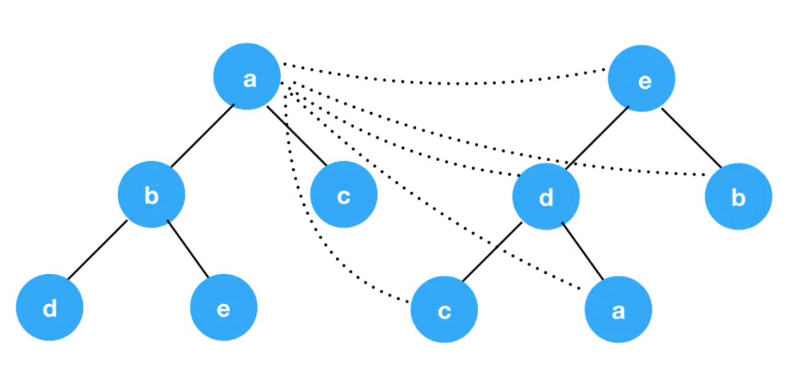
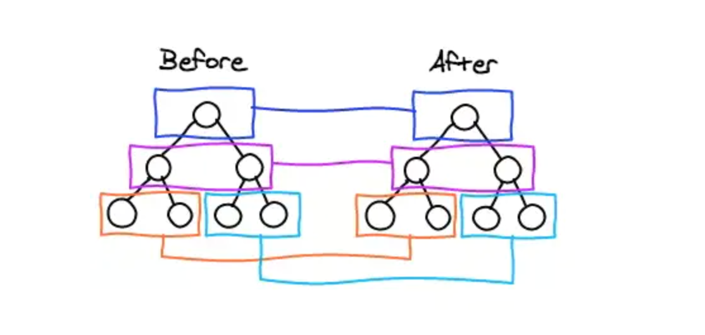
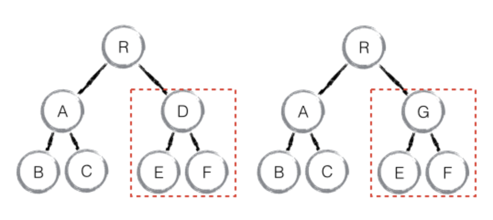
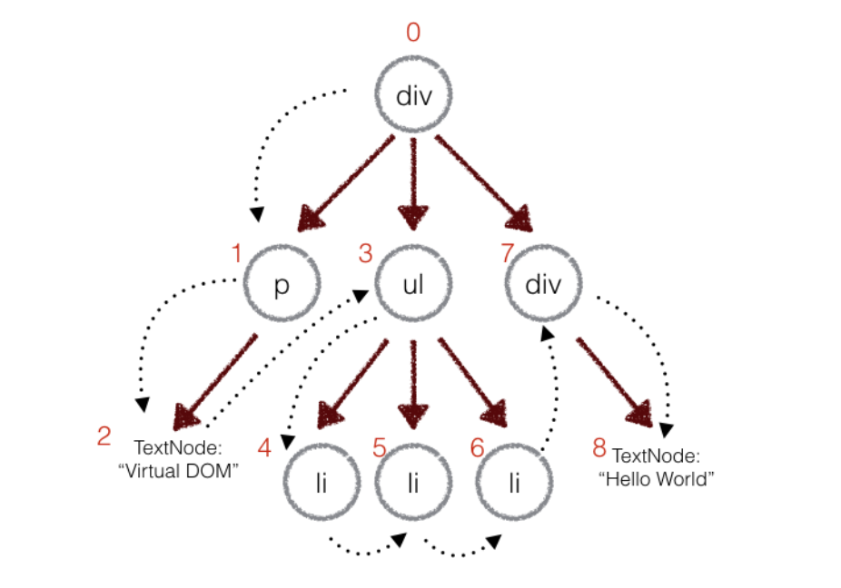
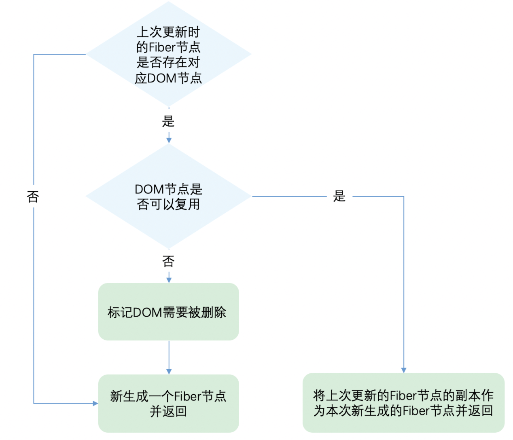

# react diff算法

## 什么是diff算法
计算一棵树转化为另一个树需要的最少步骤。

### 传统的diff算法

传统 diff 算法通过循环递归对节点进行依次对比，效率低下，算法复杂度达到 O(n^3)，其中 n 是树中节点的总数。这意味着如果要展示1000个节点，就要依次执行上十亿次的比较。这种指数型的性能消耗对于前端渲染场景来说代价太高了！



疑问：为什么是n3

假定新旧树的节点数目都为n：
1. 新dom树中某一个节点和旧树所有节点依次遍历比较，复杂度为O（n）
2. 新dom总共n个节点，每个节点遍历n次，复杂度为O（n）
3. 遍历完成发现旧dom中的某个节点被删除/添加/更新，这里需要进行最小距离转换（transform cost）， 时间复杂度均为O（n）。
这里严格来讲复杂度其实是O（m*（1+logmn）），但是我们假定这里的前提是m=n

总结一下，对于旧树上的点A来说，它要和新树上的所有点比较，复杂度为O(n)，然后如果点A在新树上没找到的话，点A会被删掉，然后遍历新树上的所有点找到一个去填空，复杂度增加为了O(n^2)，这样的操作会在旧树上的每个点进行，最终复杂度为O(n^3)。


最小距离问题：

传统的diff算法的核心方案：用动态规划计算新旧两个节点变换所有情况的最小DOM操作次数？Min(新增，删除，替换)  
得到字符串的最小编辑距离需要O(n^2)复杂度 -> 树的最小编辑距离需要O(n^3)。  
leetcode 72.编辑距离：https://leetcode-cn.com/problems/edit-distance/


### React中的diff算法
React 只会对同一层的节点作比较，不会跨层级比较。



当发下节点不存在了，会删掉该节点以及其子节点。



先序深度优先遍历，遍历时每个节点就都会有一个唯一的标记，通过fiber的sibling（下一个兄弟节点）、child（第一个子元素）、return（父节点）字段遍历节点和回溯。




## 节点的复用原则以及操作

### 节点的复用原则

1. key一样
2. type一样
3. 处于同一层级（处于同一个父节点下）

### 节点的操作
更新、新增、删除、移动

更新：

    旧：A - B - C

    新：A - B - C

新增：

    旧：A - B - C

    新：A - B - C - D - E

删除：

    旧：A - B - C - D- E

    新：A - B - C

移动：

    旧：A - B - C - D - E

    新：A - B - D - C - E

在日常开发中，相较于新增、删除和移动，更新组件发生的频率更高。所以Diff会优先判断当前节点是否属于更新。

## diff的过程
我们可以从同级的节点数量将Diff分为两类：

单节点：当newChild类型为object、number、string，代表同级只有一个节点。（newChild是新生成的jsx对象）
```js
{
  $$typeof: Symbol(react.element),
  type: "div",
  key: "a"
  ...
}
```
多节点：当newChild类型为Array，同级有多个节点。
```js
{
  $$typeof: Symbol(react.element),
  key: null,
  props: {
    children: [
      {$$typeof: Symbol(react.element), type: "li", key: "0", ref: null, props: {…}, …}
      {$$typeof: Symbol(react.element), type: "li", key: "1", ref: null, props: {…}, …}
      {$$typeof: Symbol(react.element), type: "li", key: "2", ref: null, props: {…}, …}
      {$$typeof: Symbol(react.element), type: "li", key: "3", ref: null, props: {…}, …}
    ]
  },
  ref: null,
  type: "ul"
}
```

### 单节点的diff过程
更新、增加、删除

单节点的diff过程：



React通过先判断key是否相同，如果key相同再判断type是否相同，只有都相同时一个DOM节点才能复用。

这里有个细节需要关注下：
* 当key相同且type不同时，将节点child及其兄弟fiber都标记删除。
* 当key不同时仅将child标记删除。

因为key是唯一的，如果key相同，代表该fiber对应的oldFiber已经找到，其他节点的key一定跟它是不同的，也就没有再比较的意义。
```js
function reconcileSingleElement(
  returnFiber: Fiber,
  currentFirstChild: Fiber | null,
  element: ReactElement
): Fiber {
  const key = element.key;
  let child = currentFirstChild;
  
  // 首先判断是否存在对应DOM节点
  while (child !== null) {
    // 上一次更新存在DOM节点，接下来判断是否可复用

    // 首先比较key是否相同
    if (child.key === key) {

      // key相同，接下来比较type是否相同

      switch (child.tag) {
        // ...省略case
        
        default: {
          if (child.elementType === element.type) {
            // type相同则表示可以复用
            // 返回复用的fiber
            return existing;
          }
          
          // type不同则跳出switch
          break;
        }
      }
      // 代码执行到这里代表：key相同但是type不同
      // 将该fiber及其兄弟fiber标记为删除
      deleteRemainingChildren(returnFiber, child);
      break;
    } else {
      // key不同，将该fiber标记为删除
      deleteChild(returnFiber, child);
    }
    child = child.sibling;
  }

  // 创建新Fiber，并返回 ...省略
}
```

### 多节点的diff过程

更新、增加、删除、移动

多节点需经历两轮遍历

第一轮遍历：处理更新的节点。

第一轮从头开始遍历newChildren，会逐个与oldFiber链中的节点进行比较，判断节点的key或者tag是否有变化。

没变则从newChildren节点clone它的props，赋给oldFiber，这样就实现了节点更新。
有变化说明不满足复用条件，立即中断遍历进入下一轮的遍历。
```js
let newIdx = 0;
for (; oldFiber !== null && newIdx < newChildren.length; newIdx++) {
     ...


     // 更新节点，对于DOM节点来说，updateSlot内部会判断

     // key 和 tag。任意一个不同，则返回null
     const newFiber = updateSlot(
     returnFiber,
     oldFiber,
     newChildren[newIdx],
     lanes,
);

// newFiber为null则说明当前的节点不是更新的场景，中止这一轮循环
if (newFiber === null) {
     if (oldFiber === null) {
         oldFiber = nextOldFiber;
     }
     break;
}
     ...
}
```

第二轮遍历：处理剩下的不属于更新的节点。

节点新增：

新增节点的场景很好理解，当oldFiber链遍历完，但newChildren还没遍历完，那么余下的节点都属于新插入的节点，这些节点会被打上effectTag。

旧： A - B - C

新： A - B - C - D - E


```js
if (oldFiber === null) {
  // 旧的遍历完了，意味着剩下的都是新增的了
  for (; newIdx < newChildren.length; newIdx++) {
    // 首先创建newFiber
    const newFiber = createChild(returnFiber, newChildren[newIdx], lanes);

    ...

    // 再将newFiber连接成以sibling为指针的单向链表
    if (previousNewFiber === null) {
      resultingFirstChild = newFiber;
    } else {
      previousNewFiber.sibling = newFiber;
    }
    previousNewFiber = newFiber;
  }

  return resultingFirstChild;
}
```


节点删除：

旧： A - B - C - D - E

新： A - B - C

当newChildren遍历结束，但oldFiber链还没有遍历完，那么说明剩下的节点都要被删除，那么直接在oldFiber节点上标记删除的effectTag标记。

if (newIdx === newChildren.length) {

  // 新子节点遍历完，说明剩下的oldFiber都是没用的了，可以删除
  deleteRemainingChildren(returnFiber, oldFiber);

  return resultingFirstChild;
}


节点移动：

我们来看一个例子，假设新旧的节点如下：

旧 ：A - B - C - D - E - F

新： A - B - D - C - E

第一轮遍历A和B都是key和type没变的节点，可以直接复用，但当遍历到D时，发现key变化了，跳出第一轮遍历，进入第二轮遍历。

移动节点时的参照物:

第二轮遍历中最新的固定节点的位置lastPlacedIndex为移动节点的参照物，newChildren中剩余的节点，在oldFiber中的旧位置在lastPlacedIndex的右边，说明这个节点位置不变，不需要移动节点，此时需要更新lastPlacedIndex。如果旧位置在lastPlacedIndex的左边，当前这个节点的位置要往右挪，此时无需更新lastPlacedIndex。

在以上例子中，lastPlacedIndex为1（B的位置），此时oldFiber链中还剩C - D - E - F，newChildren中还剩D - C - E。由于newChildren和oldFiber节点都没遍历完，说明需要移动位置，并且这些节点都在最新的固定节点（lastPlacedIndex）的右边。

为了在更新时方便查找,会把剩余的oldFiber节点放入existingChildren中，existingChildren以key为键，值为剩余的oldFiber节点，如：
```
{  
   C: '节点C',  
   D: '节点D',  
   E: '节点E',  
   F: '节点F'  
}  
```
newChildren的剩余部分D - C - E继续遍历，首先遍历到D，D在oldFiber链中（A - B - C - D - E）的位置为3（3 > 1），oldFiber中D的位置在B的右边，newChildren中也是如此，所以D的位置不动，此时最新的固定节点变成了D，更新lastPlacedIndex为3，并从existingChildren中删除D，existingChildren为：
```
{  
   C: '节点C',  
   E: '节点E',  
   F: '节点F'  
} 
``` 
继续遍历newChildren，遍历到C，C在oldFiber链中（A - B - C - D - E）的索引为2（2 < 3），所以要给它移动到右边，并从existingChildren中删除C，此时existingChildren为：
```
{  
   E: '节点E',  
   F: '节点F'  
}
```

再遍历到E，E在oldFiber链中（A - B - C - D - E）的位置为4（4 > 3），所以E的位置不动，此时最新的固定节点变成了E，更新lastPlacedIndex为4，并从existingChildren中删除E，existingChildren为：
```
{  
   F: '节点F'    
}
```

这个时候newChildren都处理完了，针对移动节点的遍历结束。此时existingChildren还剩一个F节点，将它删除即可。

