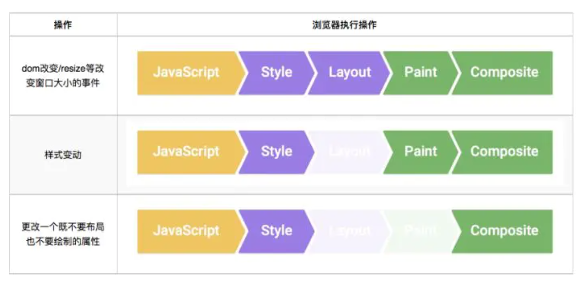
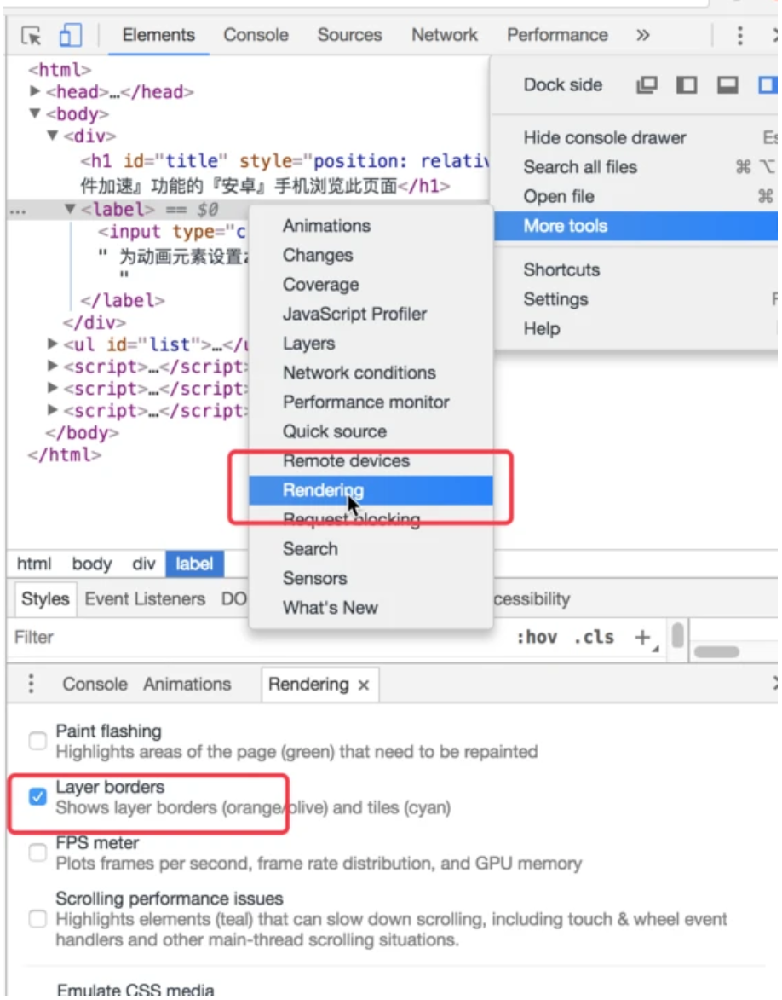

# 浏览器渲染
我们知道网页动画的每一帧都是一次重新渲染，每秒低于24镇的动画，人眼就能感受到停顿，每秒30-60帧才能比较流畅 浏览器会按照大多数显示器的刷新频率60Hz来刷新动画， 如果想达到60FPS,就意味着每一帧的任务耗时不能高于16毫秒。

通过下图我们可以了解浏览器渲染每一帧的过程

* JavaScript
一般来说，我们会使用 JavaScript 来实现一些视觉变化的效果。比如用 jQuery 的 animate 函数做一个动画、对一个数据集进行排序或者往页面里添加一些 DOM 元素等。当然，除了 JavaScript，还有其他一些常用方法也可以实现视觉变化效果，比如：CSS Animations、Transitions 和 Web Animation API。
* 样式计算
此过程是根据匹配选择器（例如 .headline 或 .nav > .nav__item）计算出哪些元素应用哪些 CSS 3. 规则的过程。从中知道规则之后，将应用规则并计算每个元素的最终样式。
* 布局
在知道对一个元素应用哪些规则之后，浏览器即可开始计算它要占据的空间大小及其在屏幕的位置。网页的布局模式意味着一个元素可能影响其他元素，例如 元素的宽度一般会影响其子元素的宽度以及树中各处的节点，因此对于浏览器来说，布局过程是经常发生的。
* 绘制
绘制是填充像素的过程。它涉及绘出文本、颜色、图像、边框和阴影，基本上包括元素的每个可视部分。绘制一般是在多个表面（通常称为层）上完成的。
* 合成
由于页面的各部分可能被绘制到多层，由此它们需要按正确顺序绘制到屏幕上，以便正确渲染页面。对于与另一元素重叠的元素来说，这点特别重要，因为一个错误可能使一个元素错误地出现在另一个元素的上层。
“生成布局”（flow）和”绘制"（paint）这两步，合称为"渲染"（render）。重新渲染就是需要重新生成布局和重新绘制。

前端新能优化最主要的优化点就是尽量减少重绘和重排。

## 使用css3 transform
解释为什么transform的动画执行效果更佳
因为每一帧的变化浏览器都在进行布局、绘制、把新的位图交给 GPU 内存，但是在将位图加载到GPU内存中的操作是个相对耗时的操作。
GPU 在如下方面很快：
1. 绘制位图到屏幕上
2. 可不断的绘制相同的位图
3. 将同一位图进行位移、旋转、缩放

## 层的引入
页面一旦在装入并解析完成后，就会表示为许多Web开发者所熟悉的结构：DOM。然而，在页面的渲染过程中，浏览器还具有一系列并不直接暴露给开发者的页面中间表示方式。这些表示方式中最重要的结构就是层。

在Chrome中实际上有几种不同类型的层：  
掌管DOM子树的渲染层（RenderLayer）以及掌管渲染层子树的图形层（GraphicsLayer），某些特殊的渲染层会被认为是合成层（Compositing Layers，合成层拥有单独的 GraphicsLayer。

拥有单独GraphicsLayer的层，都会将位图存储在共享内存中，作为纹理上传到 GPU 中，最后由 GPU 将多个位图进行合成，然后 draw 到屏幕上。

### 什么渲染层会提升为合成层？
Chrome在这方面采用的规则仍在随着时间推移逐渐发展变化，但在目前下面这些因素都会引起Chrome创建层：
* 进行3D或者透视变换的CSS属性
* 使用硬件加速视频解码的<video>元素
* 具有3D（WebGL）上下文或者硬件加速的2D上下文的<canvas>元素
* 组合型插件（即Flash）
* 具有有CSS透明度动画或者使用动画式Webkit变换的元素
* 具有硬件加速的CSS滤镜的元素
* 子元素中存在具有组合层的元素的元素（换句话说，就是存在具有自己的层的子元素的元素）
* 同级元素中有Z索引比其小的元素，而且该Z索引比较小的元素具有组合层（换句话说就是在组合层之上进行渲染的元素）

### 提升为合成层简单说来有以下几点好处
* 合成层的位图，会交由 GPU 合成，比 CPU 处理要快
* 当需要 repaint 时，只需要 repaint 本身，不会影响到其他的层
* 对于 transform 和 opacity 效果，不会触发 layout 和 paint
* 合成层的好处是不会影响到其他元素的绘制，因此，为了减少动画元素对其他元素的影响，从而减少 paint，我们需要把动画效果中的元素提升为合成层。

提升合成层的最好方式是使用 CSS 的 will-change 属性。从上一节合成层产生原因中，可以知道 will-change 设置为 opacity、transform、top、left、bottom、right 可以将元素提升为合成层。

对于那些目前还不支持 will-change 属性的浏览器，目前常用的是使用一个 3D transform 属性来强制提升为合成层：transofrm: translateZ(0)

### 利用合成层可能踩到的坑
合成层占用内存的问题

#### 层爆炸
由于某些原因可能导致产生大量不在预期内的合成层，虽然有浏览器的层压缩机制，但是也有很多无法进行压缩的情况，这就可能出现层爆炸的现象（简单理解就是，很多不需要提升为合成层的元素因为某些不当操作成为了合成层）。

解决层爆炸：  
最佳方案是打破 overlap 的条件，也就是说让其他元素不要和合成层元素重叠。简单直接的方式：使用3D硬件加速提升动画性能时，最好给元素增加一个z-index属性，人为干扰合成的排序，可以有效减少chrome创建不必要的合成层，提升渲染性能，移动端优化效果尤为明显。 

用chremo打开demo页面后，开启浏览器的开发者模式，再按照如图操作打开查看工具：

开启 Rendering 的Layer borders后 观察点击为动画元素设置z-index复选框的页面提示变化：

举例：  
页面中设置了一个h1标题，应用了translate3d动画，使得它被放到composited layer中渲染，然后在这个元素后面创建了2000个list。在不为h1元素设置z-index的情况下，使得本不需要提升到合成层的ul元素下的每个li元素都提升为一个单独合成层（每个li元素的黄色提示边框），最终会导致GPU资源过度消耗页面滑动时很卡，尤其在移动端（安卓）上更加明显。  
解决：  
选中为动画元素设置z-index，可以看出ul下的每个li都回归到普通渲染层，不再是合成层也就不会消耗GPU资源去渲染，从而达到了优化页面性能优化的目的。

