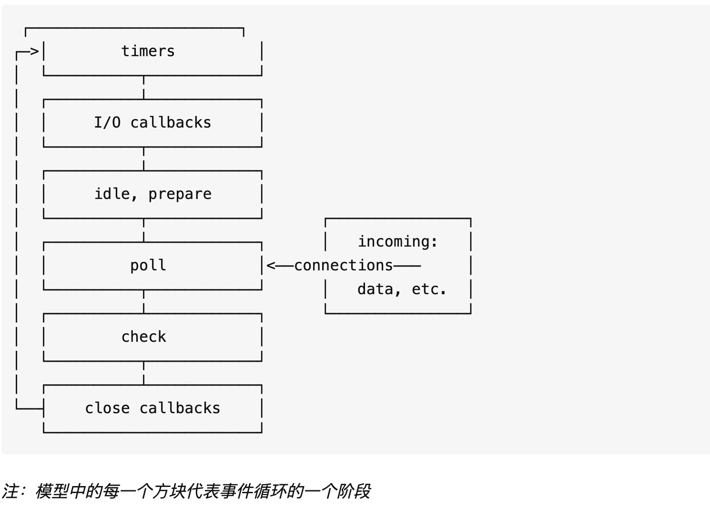

# node环境下的事件循环机制

## 与浏览器环境有何不同?
在node中，事件循环表现出的状态与浏览器中大致相同。不同的是node中有一套自己的模型。node中事件循环的实现是依靠的libuv引擎。我们知道node选择chrome v8引擎作为js解释器，v8引擎将js代码分析后去调用对应的node api，而这些api最后则由libuv引擎驱动，执行对应的任务，并把不同的事件放在不同的队列中等待主线程执行。 因此实际上node中的事件循环存在于libuv引擎中。

## 事件循环模型
下面是一个libuv引擎中的事件循环的模型:



每个阶段都有一个要执行的回调 FIFO 队列。 尽管每个阶段都有其自己的特殊方式，但是通常，当事件循环进入给定阶段时，它将执行该阶段特定的任何操作，然后在该阶段的队列中执行回调，直到队列耗尽或执行回调的最大数量为止。 当队列已为空或达到回调限制时，事件循环将移至下一个阶段，依此类推。

## 事件循环各阶段详解
node事件循环的执行顺序：外部输入数据-->轮询阶段(poll)-->检查阶段(check)-->关闭事件回调阶段(close callback)-->定时器检测阶段(timer)-->I/O事件回调阶段(I/O callbacks)-->闲置阶段(idle, prepare)-->轮询阶段...

* timers: 这个阶段执行定时器队列中的回调如 setTimeout() 和 setInterval()。
* I/O callbacks: 这个阶段执行几乎所有的回调。但是不包括close事件，定时器和setImmediate()的回调。
* idle, prepare: 这个阶段仅在内部使用，可以不必理会。
* poll: 取出新完成的 I/O 事件；执行与 I/O 相关的回调（除了关闭回调，计时器调度的回调和 setImmediate 之外，几乎所有这些回调） 适当时，node 将在此处阻塞。
* check: setImmediate()的回调会在这个阶段执行。
* close callbacks: 例如socket.on('close', ...)这种close事件的回调。

### poll阶段
轮询阶段具有两个主要功能：
* 计算应该阻塞并 I/O 轮询的时间
* 处理轮询队列 (poll queue) 中的事件

当事件循环进入轮询 (poll) 阶段并且没有任何计时器调度 (timers scheduled) 时，将发生以下两种情况之一：
1. 如果轮询队列 (poll queue) 不为空，则事件循环将遍历其回调队列，使其同步执行，直到队列用尽或达到与系统相关的硬限制为止 (到底是哪些硬限制？)。
2. 如果轮询队列为空，则会发生以下两种情况之一：
   * 如果已通过 setImmediate 调度了脚本，则事件循环将结束轮询 poll 阶段，并继续执行 check 阶段以执行那些调度的脚本。
   * 如果脚本并没有 setImmediate 设置回调，则事件循环将等待 poll 队列中的回调，然后立即执行它们。

一旦轮询队列 (poll queue) 为空，事件循环将检查哪些计时器 timer 已经到时间。 如果一个或多个计时器 timer 准备就绪，则事件循环将返回到计时器阶段，以执行这些计时器的回调。

### check阶段
check阶段专门用来执行setImmediate()方法的回调，当poll阶段进入空闲状态，并且setImmediate queue中有callback时，事件循环进入这个阶段。

### close阶段
当一个socket连接或者一个handle被突然关闭时（例如调用了socket.destroy()方法），close事件会被发送到这个阶段执行回调。否则事件会用process.nextTick（）方法发送出去。

### timer阶段
这个阶段以先进先出的方式执行所有到期的timer加入timer队列里的callback，一个timer callback指得是一个通过setTimeout或者setInterval函数设置的回调函数。

### I/O callback阶段
如上文所言，这个阶段主要执行大部分I/O事件的回调，包括一些为操作系统执行的回调。例如一个TCP连接生错误时，系统需要执行回调来获得这个错误的报告。

## process.nextTick,setTimeout与setImmediate的区别与使用场景

node中有三个常用的用来推迟任务执行的方法：process.nextTick,setTimeout（setInterval与之相同）与setImmediate

### process.nextTick()
process.nextTick是在当前执行完，下次遍历前执行

实际上node中存在着一个特殊的队列，即nextTick queue。这个队列中的回调执行虽然没有被表示为一个阶段，当时这些事件却会在每一个阶段执行完毕准备进入下一个阶段时优先执行。当事件循环准备进入下一个阶段之前，会先检查nextTick queue中是否有任务，如果有，那么会先清空这个队列。

### setTimeout()和setImmediate()
* setImmediate是在当前队列立即执行
* setTimout/setInterval是把执行定时到到后面的队列

setTimeout()和不设置时间间隔的setImmediate()表现上及其相似。猜猜下面这段代码的结果是什么？
```js
setTimeout(() => {
    console.log('timeout');
}, 0);

setImmediate(() => {
    console.log('immediate');
});
```
实际上，答案是不一定。没错，就连node的开发者都无法准确的判断这两者的顺序谁前谁后。这取决于这段代码的运行环境。运行环境中的各种复杂的情况会导致在同步队列里两个方法的顺序随机决定。但是，在一种情况下可以准确判断两个方法回调的执行顺序，那就是在一个I/O事件的回调中。下面这段代码的顺序永远是固定的：
```js
const fs = require('fs');

fs.readFile(__filename, () => {
    setTimeout(() => {
        console.log('timeout');
    }, 0);
    setImmediate(() => {
        console.log('immediate');
    });
});
// immediate
// timeout
```
因为在I/O事件的回调中，setImmediate方法的回调永远在timer的回调前执行。

那为什么在外部 (比如主代码部分 mainline) 这两者的执行顺序不确定呢？

解答：在 mainline 部分执行 setTimeout 设置定时器 (没有写入队列呦)，与 setImmediate 写入 check 队列。mainline 执行完开始事件循环，第一阶段是 timers，这时候 timers 队列可能为空，也可能有回调；如果没有那么执行 check 队列的回调，下一轮循环在检查并执行 timers 队列的回调；如果有就先执行 timers 的回调，再执行 check 阶段的回调。因此这是 timers 的不确定性导致的。

## 参考链接
https://learnku.com/articles/38802