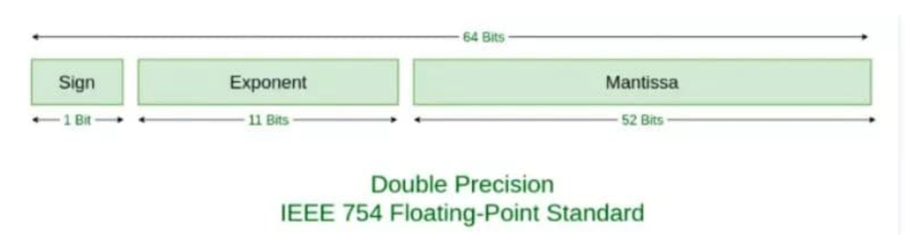

# 浮点精确数 0.1+0.2  != 0.3

0.1 + 0.2 是否等于 0.3  这是浮点数精度问题导致

十进制的0.1和0.2都会被转换成二进制，但由于有些浮点数用二进制表达时是无穷的（例如0.1、0.2)。标准的 64 位双精度浮点数的小数部分最多支持 52 位二进制位，所以浮点数小数位的限制而截断的二进制数字，进行运算后，再转换为十进制，就会产生误差。 

这种问题根本原因是在于：计算机都是0或1标识，对于某浮点准确值，是通过不断增加位数去逼近该值。浮点数实现这种方式就是移位运算，所以不管是在表示还是运算时,都会出现误差

## 浮点数的存储
IEEE754 给出了存储浮点数的标准：


在这个标准下：
我们会用 1 位存储 S，0 表示正数，1 表示负数。  
用 11 位存储 E + bias，对于 11 位来说，bias 的值是 2^(11-1) - 1，也就是 1023。  
用 52 位存储 Fraction。  
举个例子，就拿 0.1 来看，对应二进制是 1 * 1.1001100110011…… * 2^-4， Sign 是 0，E + bias 是 -4 + 1023 = 1019，1019 用二进制表示是 1111111011，Fraction 是 1001100110011……
对应 64 个字节位的完整表示就是：
```js
0 01111111011 1001100110011001100110011001100110011001100110011010
```
同理, 0.2 表示的完整表示是：
```js
0 01111111100 1001100110011001100110011001100110011001100110011010
```
所以当 0.1 存下来的时候，就已经发生了精度丢失，当我们用浮点数进行运算的时候，使用的其实是精度丢失后的数。

## 浮点数的运算
关于浮点数的运算，一般由以下五个步骤完成：对阶、尾数运算、规格化、舍入处理、溢出判断。我们来简单看一下 0.1 和 0.2 的计算。  
首先是对阶，所谓对阶，就是把阶码调整为相同，比如 0.1 是 1.1001100110011…… * 2^-4，阶码是 -4，而 0.2 就是 1.10011001100110...* 2^-3，阶码是 -3，两个阶码不同，所以先调整为相同的阶码再进行计算，调整原则是小阶对大阶，也就是 0.1 的 -4 调整为 -3，对应变成 0.11001100110011…… * 2^-3  
接下来是尾数计算:
```js
  0.1100110011001100110011001100110011001100110011001101
+ 1.1001100110011001100110011001100110011001100110011010
————————————————————————————————————————————————————————
 10.0110011001100110011001100110011001100110011001100111
```
我们得到结果为 10.0110011001100110011001100110011001100110011001100111 * 2^-3
将这个结果处理一下，即结果规格化，变成 
```js
1.0011001100110011001100110011001100110011001100110011(1) * 2^-2
```
括号里的 1 意思是说计算后这个 1 超出了范围，所以要被舍弃了。  
再然后是舍入，四舍五入对应到二进制中，就是 0 舍 1 入，因为我们要把括号里的 1 丢了，所以这里会进一，结果变成
```js
1.0011001100110011001100110011001100110011001100110100 * 2^-2
```
本来还有一个溢出判断，因为这里不涉及，就不讲了。  
所以最终的结果存成 64 位就是
```js
0 01111111101 0011001100110011001100110011001100110011001100110100
```
将它转换为10进制数就得到 0.30000000000000004440892098500626  
因为两次存储时的精度丢失加上一次运算时的精度丢失，最终导致了 0.1 + 0.2 !== 0.3

## 解决
简单的方法使用toFixed 
```js
parseFloat((数学表达式).toFixed(digits))； // toFixed() 精度参数须在 0 与20 之间 
// 运行 
console.log(parseFloat((float1-float2).toFixed(10)));//7.1 
```
toFixed() 方法可把 Number 四舍五入为指定小数位数的数字。参数为指定小数位数   
将小数部分单独提取出来作为整数运算然后在拼接，这里我们可以使用封装好的lib。

## 其他
```js
// 十进制转二进制
parseFloat(0.1).toString(2);
=> "0.0001100110011001100110011001100110011001100110011001101"

// 二进制转十进制
parseInt(1100100,2)
=> 100

// 以指定的精度返回该数值对象的字符串表示
(0.1 + 0.2).toPrecision(21)
=> "0.300000000000000044409"
(0.3).toPrecision(21)
=> "0.299999999999999988898"
```