# 移动端适配

## 背景
小程序开发(taro框架)中，遇到了这样的问题，边框消失了
```js
border: 1px solid blue; 
```
开发过taro的同学应该知道，1px会被转成1rpx。

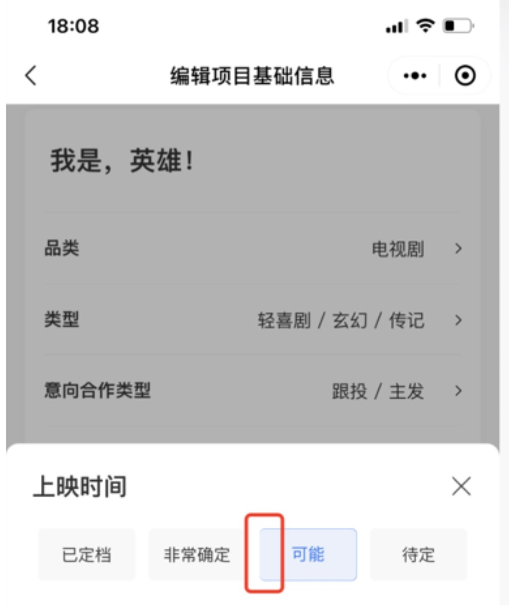

有人研究了这个现象，得出结论  
当标签的父容器宽度(单位rpx)÷2的值为偶数或偶数.5的时候会出现该bug。  
参考：https://blog.csdn.net/c5211314963/article/details/

微信开发者社区并没有给出官方回应。相反出现问题的倒很多。

社区中有一种修改方法就是别用rpx，直接写px
```js
解决方法：使用1PX，不转单位
```
## 基础概念
1. 英寸 
2. 屏幕分辨率:⼀一个屏幕具体由多少像素点组成。 
3. PPI:对⻆线每英寸含的像素点，PPI越高，越清晰
4. 物理像素:真实的⼿机上的发光点
5. 设备独⽴像素:抽象的描述元素大小的单位 
6. css像素:web开发的单位，px为css像素，属于设备独立像素，计算机控制的逻辑单位
6. 设备像素比:物理像素/设备像素
7. 布局视口:⼤部分默认980px，为了了保证⽹网站的外观特性与pc⼀一致。 
8. 视觉视⼝:⽤户看到的⽹页的区域，缩放会影响看到的范围⼤小。但不影响布局视口。 
9. 理想视⼝:理想中可以完美适配移动端的viewport，可以认为是设备宽度(device- width)
10. 视觉视口计算⽅法为:理理想视⼝宽度/initial-scale，理理想视⼝宽度可以理解为屏幕
宽度。
12. 布局视⼝取width和视觉视口的最⼤值

## 移动端适配方案

### 方案1—网易rem方案
```js
<meta name="viewport" content="initial-scale=1,maximum-scale=1, minimum-scale=1">

(function () {
    function resize() {
      var deviceWidth = document.documentElement.clientWidth;
    document.documentElement.style.fontSize = (deviceWidth / 7.5) +'px';
   }
    resize();
    window.onresize = resize;
  })()
```
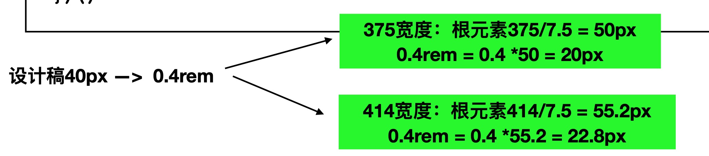

* 优点: 简单、开发⽅方便便 
* 缺点: ⼤大屏幕只是元素放⼤大了了，对于想要⼤大屏幕展示更更多内容的需求来说不不太满⾜足

### ⽅案2—rem+⾼高清屏的淘宝flexible⽅方案
特点:ios下，通过设置initial-scale使物理像素和独立设备像素⼀一对 应。其余和⽹易⽅案差不多

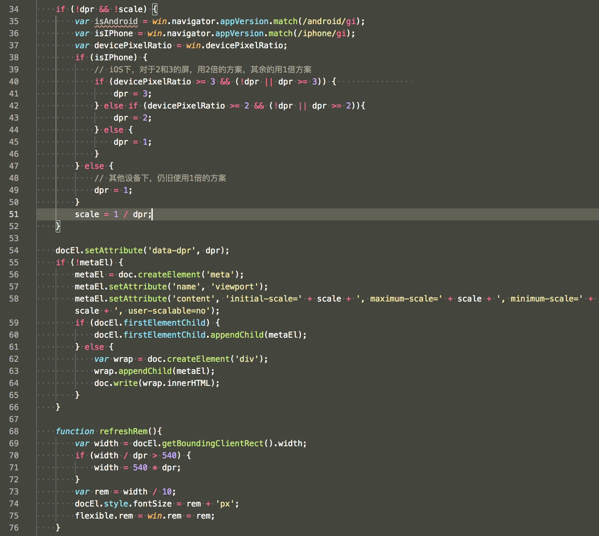

#### Iphone 6举例

```js
<html lang="en" data-scale="true" data-dpr="2" style="font-size: 75px;">
 
<meta name="viewport" content="initial-scale=0.5, maximum-scale=0.5, minimum-scale=0.5, user-scalable=no">
```

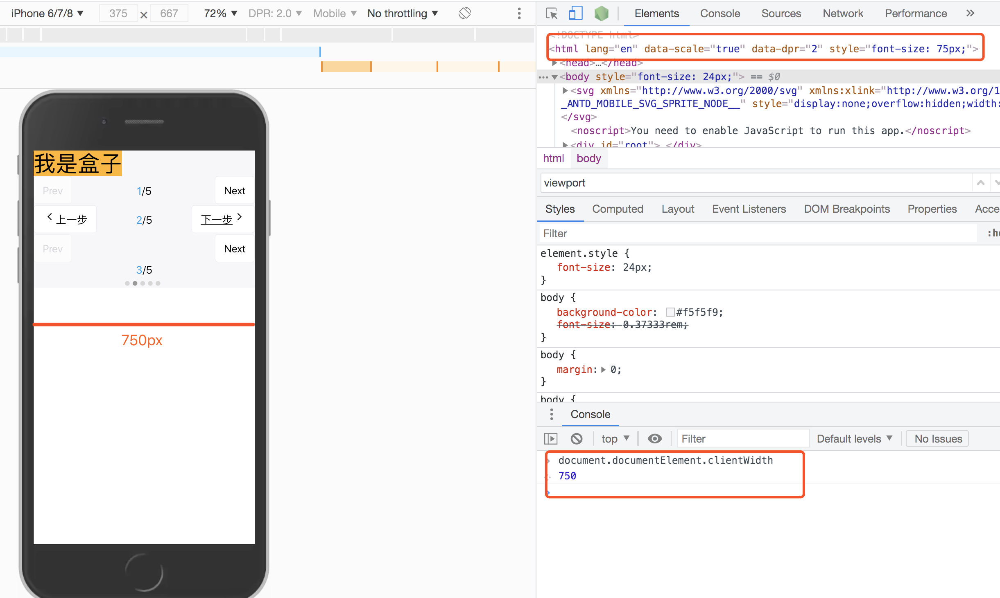

```
300px ——> 300/75 = 4rem
```

#### Iphone 6plus举例
```js
<html lang="en" data-scale="true" data-dpr="3" style="font-size: 124.2px;">
<meta name="viewport" content="initial-scale=0.3333333333333333, maximum-scale=0.3333333333333333, minimum-scale=0.3333333333333333, user-scalable=no">
```
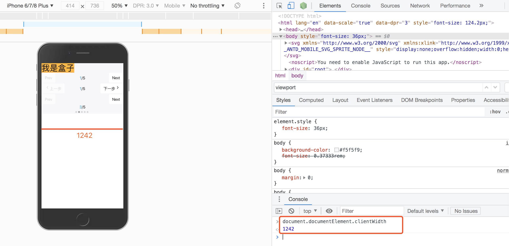

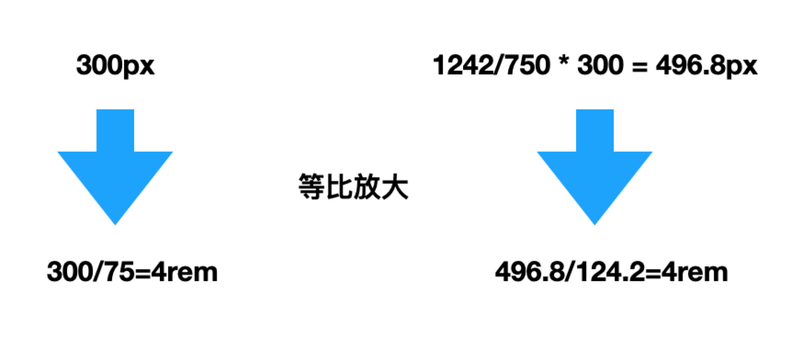

#### 对比
1. 安卓⼿机没有处理，效果和1倍屏相同
2. 对比⽹易方案，需要⾃己计算px转化到rem，可以借助工具:
   * cssrem插件
   * Css处理理器
   * PostCSS的插件 px2rem
3. 字体不不推荐rem
```css
div {
    width: 1rem;
    height: 0.4rem;
    font-size: 12px; // 默认写上dpr为1的fontSize
}
[data-dpr="2"] div {
    font-size: 24px;
}
[data-dpr="3"] div {
    font-size: 36px;
}
```

缺点：
1. 嵌套iframe容易出问题

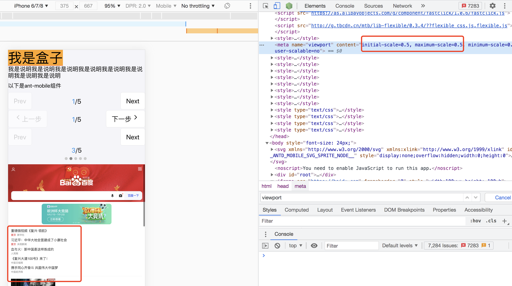 

2. 组件库不默认支持
```js
很多组件库没有对适配进行处理，对组件库适配的讨论可以查看这个知乎问答：https://www.zhihu.com/question/275803537，有些组件库是用px单位写的（以375px的屏幕为标准），所以默认使用的基础是width=device-width,initial-scale=1，flexible的缩放会影响展示，2倍屏会被缩小1倍。很难适配修改。
```

### 方案3—vw、wh
vw已经得到了众多浏览器的支持，可以取代rem

```js
<meta name="viewport" content="width=device-width, initial-scale=1, maximum-scale=1, minimum-scale=1, user-scalable=no" />
```
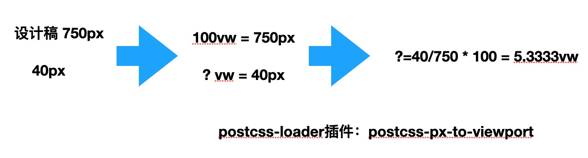 

#### 适用场景
* 容器适配，可以使用vw
* 文本的适配，可以使用vw
* 大于1px的边框、圆角、阴影都可以使用vw
* 内距和外距，可以使用vw

缺陷
* px转换成vw不一定能完全整除，因此有一定的像素差。
* 比如当容器使用vw，margin采用px时，很容易造成整体宽度超过100vw，从而影响布局效果。当然我们也是可以避免的，例如使用padding代替margin，结合calc()函数使用等等...

### 方案4-px为主，vw、vh为辅，搭配flex媒体查询
这个是目前比较推荐的一种方式，因为用户买大手机，是为了看到更多的内容，而不是更大的字。适配流程如下：

1. 在head 设置width=device-width的viewport，不设置缩放
```js
<meta name="viewport" content="width=device-width, initial-scale=1.0, user-scalable=no">
```
2. 在css中使用px
假设设计稿为750px，元素40px，那我们就写成20px。但是这个20px就会展示20px，不管在375的屏幕上，还是320的屏幕还是414的屏幕上。这样达到了屏大字多的效果
3. 在适当的场景使用flex布局，或者配合vw进行自适应
4. 在跨设备类型的时候进行媒体查询
5. 在跨设备类型如果交互差异太大的情况，考虑分开项目开发。

## 方案选择
1. 项目简单，追求简单快速，接受等比缩放可以用全rem方案，推荐网易的那种方式。
2. 设计要求就要按屏幕大小等比缩放，那就选择vw、vh或rem方案。
3. 如果需要屏大内容多，不缩放元素，那就px+flex。
4. 甚至我们去组合使用这些技巧。
5. 个人不建议再使用flexible的缩放方案。


## 小程序适配
小程序rpx，自适应  
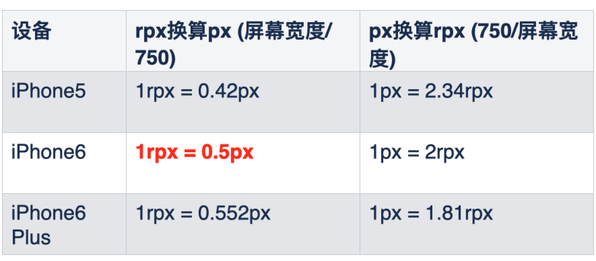 
taro中 1px 会被转换为1rpx，如果不希望转换的话写1PX

## 1px问题
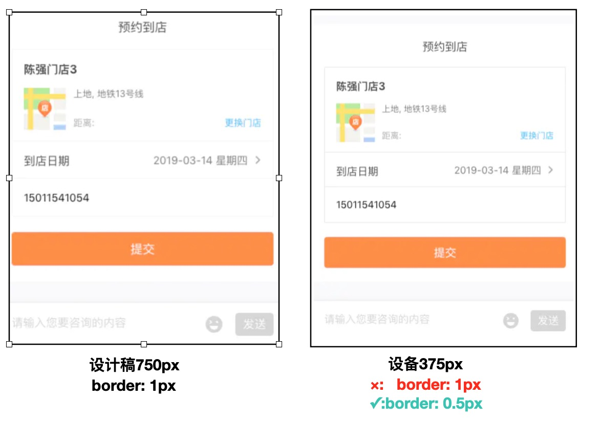 
```
1px（1rpx，0.5px）：发现缺失
1PX（1px）：发现变粗
```

### 直接写0.5px
```
border:0.5px solid #E5E5E5
```

优点：简单、没有副作用  
缺点：支持ios 8+，部分安卓手机不支持。  
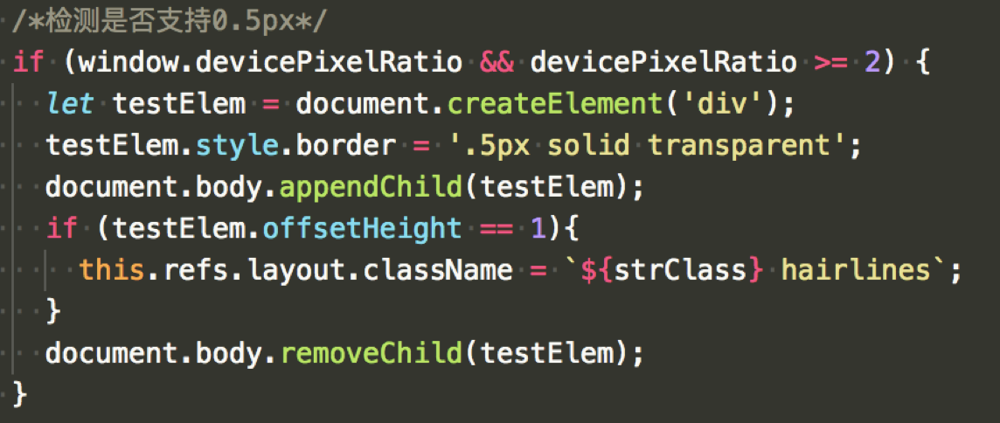 

### 模拟0.5px
* 伪类+transform实现（推荐）
* 线性渐变
* box-shdow
* svg （推荐）
* background图片
