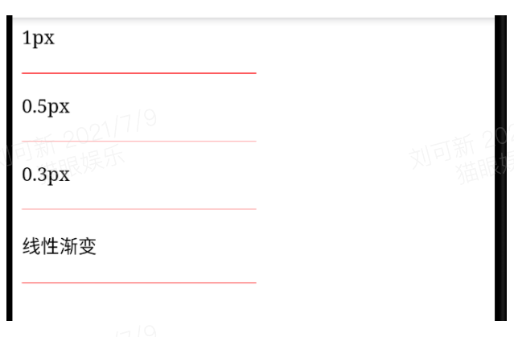
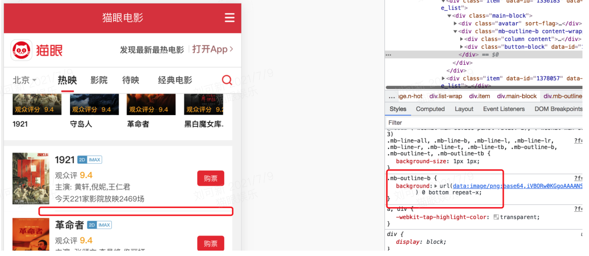
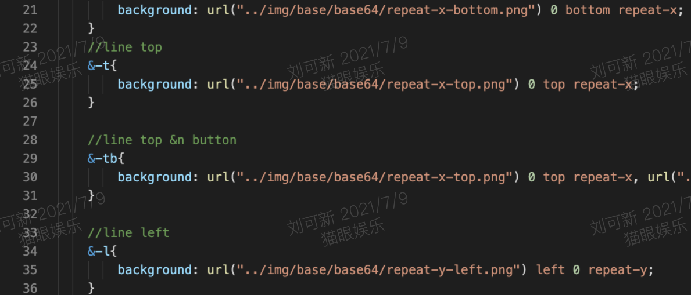

# 0.5width

## 改变自身进行缩放
```css
<div id="div1"></div>

#div1{
    height:200px;
    widht:200px;
    border:1px solid #888;
    transfrom:scale(0.5);
    transfrom-origin:0 0 ;
}
```

## 伪类+transform实现（推荐）

### 单条border样式设置
```css
.scale {
  margin-top: 20px;
  width: 200px;
  height: 100px;
  border: none;
  position: relative;
  background: yellow;
}
.scale::after {
  content: '';
  position: absolute;
  left: 0;
  bottom: 0;
  background: red;
  width: 100%;
  height: 1px;
  transform: scaleY(0.5);
  -webkit-transform-origin: left top;
  transform-origin: left top;
}
```

### 四条border样式设置
```css
.scale {
  margin-top: 20px;
  width: 200px;
  height: 100px;
  border: none;
  position: relative;
  background: yellow;
}
.scale::after {
  content: '';
  position: absolute;
  top: 0;
  left: 0;
  border: 1px solid red;
  -webkit-box-sizing: border-box;
  box-sizing: border-box;
  width: 200%;
  height: 200%;
  -webkit-transform: scale(0.5);
  transform: scale(0.5);
  -webkit-transform-origin: left top;
  transform-origin: left top;
}
```

如果有圆角呢? 也可以，将圆角弧度也设置大一倍

```css
.scale {
  margin-top: 20px;
  width: 200px;
  height: 100px;
  border: none;
  position: relative;
  background: orange;
  border-radius: 50px;
}
.scale::after {
  content: '';
  position: absolute;
  top: 0;
  left: 0;
  border: 1px solid red;
  -webkit-box-sizing: border-box;
  box-sizing: border-box;
  width: 200%;
  height: 200%;
  border-radius: 100px;
  -webkit-transform: scale(0.5);
  transform: scale(0.5);
  -webkit-transform-origin: left top;
  transform-origin: left top;
}
```

优点：ios和安卓都支持，颜色和圆角都可以自己设置

## 线性渐变
```css
.scale {   
    height: 1px;
    background: linear-gradient(0deg, #fff, red);
}
```
linear-gradient(0deg, #fff, #000)的意思是：渐变的角度从下往上，从白色#fff渐变到red，而且是线性的，在高清屏上，1px的逻辑像素代表的物理（设备）像素有2px，由于是线性渐变，所以第1个px只能是#fff，而剩下的那个像素只能是#000，这样就达到了画一半的目的。逻辑分析很完美，实际的效果又怎么样呢，如下图所示：




缺点：不好画圆角

## box-shadow
```css
height: 1px;
background: none;
box-shadow: 0 0.5px 0 red;
```
缺点：safari不支持0.5以下的box-shadow

## 使用svg
```js
<style>
.hr.svg {
    background: none;
    height: 1px;
    background: url("data:image/svg+xml;utf-8,<svg xmlns='http://www.w3.org/2000/svg' width='100%' height='1px'><line x1='0' y1='0' x2='100%' y2='0' stroke='#000'></line></svg>");
}
</style>

<p>svg</p>
<div class="hr svg"></div>
设置background为一个svg文件，这个svg单独拷出来是这样的：
<svg xmlns='http://www.w3.org/2000/svg' width='100%' height='1px'>
    <line x1='0' y1='0' x2='100%' y2='0' stroke='#000'></line>
</svg>
```

使用svg的line元素画线，stroke表示描边颜色，默认描边宽度stroke-width="1"，由于svg的描边等属性的1px是物理像素的1px，相当于高清屏的0.5px，另外还可以使用svg的rect等元素进行绘制。

这个方案也是很完美，但是在firefox挂了，究其原因是因为firefox的background-image如果是svg的话只支持命名的颜色，如"black"、"red"等，如果把上面代码的svg里面的#000改成black的话就可以显示出来，但是这样就很不灵活了。否则只能把svg转成base64的形式，我们把svg的内容转成base64（可以找一些在线的工具），对比如下：
```css
hr.svg {
    background: url("data:image/svg+xml;utf-8,<svg xmlns='http://www.w3.org/2000/svg' width='100%' height='1px'><line x1='0' y1='0' x2='100%' y2='0' stroke='#000'></line></svg>");
    background: url("data:image/svg+xml;base64,PHN2ZyB4bWxucz0naHR0cDovL3d3dy53My5vcmcvMjAwMC9zdmcnIHdpZHRoPScxMDAlJyBoZWlnaHQ9JzFweCc+PGxpbmUgeDE9JzAnIHkxPScwJyB4Mj0nMTAwJScgeTI9JzAnIHN0cm9rZT0nIzAwMCc+PC9saW5lPjwvc3ZnPg==");
}
```
这样在firefox也能完美展示了。

## background图片
这是猫眼首页项目使用的方案



在outline.scss中设置了一些通用的边框类，这些边框已经实现了1px，在njk页面引入这些类就可以达到1px边框的效果。
outline.scss中实现1px的方法是：
1. 准备一张符合条件的边框背景图，模拟在背景上。


2. 基于media查询判断等于2或3的设备像素比，background-size设置为高为1px


优点：所有设备都支持
缺点：如果四边边框的话，写法比较麻烦，四个边都有写成具体的元素，不支持圆角

## 总结
通过以上方法和实践，最后发现transfrom scale/svg的方法兼容性和效果都是最好的，svg可以支持复杂的图形。不过由于颜色的问题，需要找工具转一下。