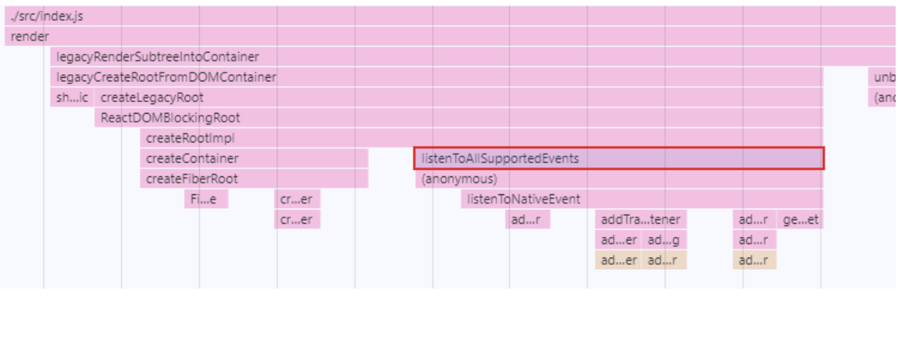
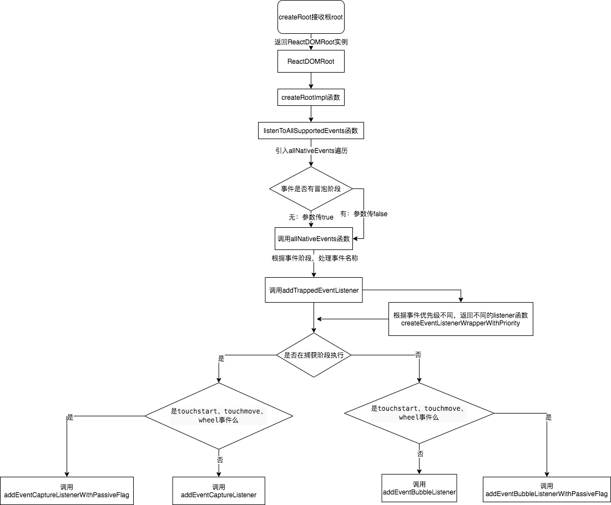
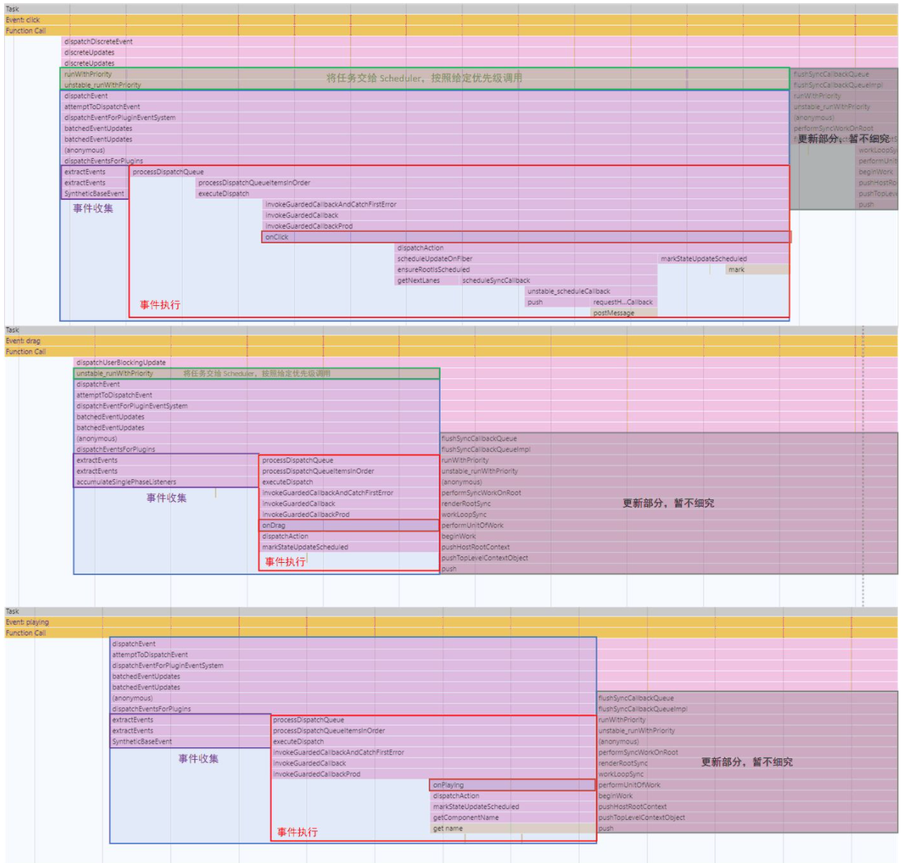
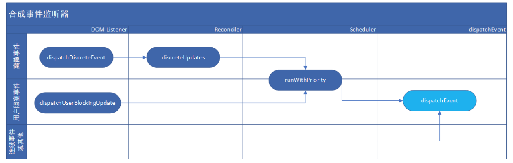
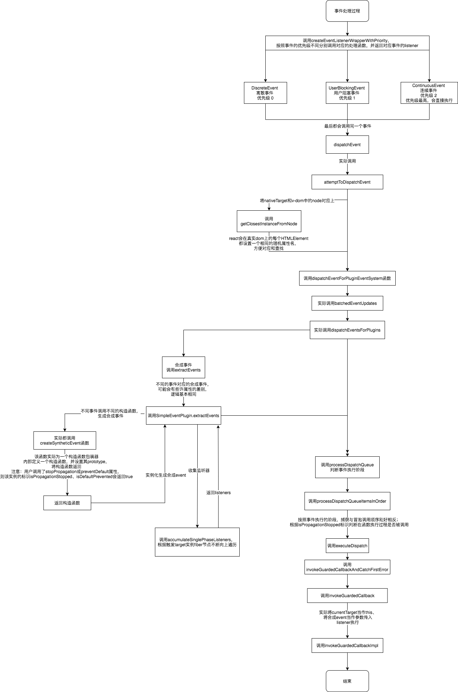

# react源码分析之事件机制

## 初始化合成事件系统

入口程序在 react-dom/src/events/DOMPluginEventSystem.js#L89-L93

### EventPlugin
src/react/packages/react-dom/src/events/DOMPluginEventSystem.js

这五个 EventPlugin 关系可以这么理解，SimpleEventPlugin 是合成事件系统的基本功能实现，而其他的几个 EventPlugin 只不过是它的 polyfill。

* SimpleEventPlugin.registerEvents();
* EnterLeaveEventPlugin.registerEvents();
* ChangeEventPlugin.registerEvents();
* SelectEventPlugin.registerEvents();
* BeforeInputEventPlugin.registerEvents();

### eventPriorities
src/react/packages/react-dom/src/events/DOMEventProperties.js

原生事件及其优先级的映射
```js
{
  "cancel": 0,
  // ...
  "drag": 1,
  // ...
  "abort": 2,
  // ...
}
```
React 对原生事件的优先级定义主要有三类:
1. export const DiscreteEvent: EventPriority = 0; // 离散事件，cancel、2.2. click、mousedown 这类单点触发不持续的事件，优先级最低
2. export const UserBlockingEvent: EventPriority = 1; // 用户堵塞事件，drag、mousemove、wheel 这类持续触发的事件，优先级相对较高
3. export const ContinuousEvent: EventPriority = 2; // 连续事件，load、error、waiting 这类大多与媒体相关的事件为主的事件需要及时响应，所以优先级最高

### topLevelEventsToReactNames
src/react/packages/react-dom/src/events/DOMEventProperties.js

原生事件和合成事件的映射
```js
{
  "cancel": "onCancel",
  // ...
  "pointercancel": "onPointerCancel",
  // ...
  "waiting": "onWaiting"
}
```
### registrationNameDependencies
src/react/packages/react-dom/src/events/EventRegistry.js

合成事件和其依赖的原生事件集合的映射
```js
{
  "onCancel": ["cancel"],
  "onCancelCapture": ["cancel"],
  // ...
  "onChange": ["change", "click", "focusin","focusout", "input", "keydown", "keyup", "selectionchange"],
  "onCancelCapture": ["change", "click", "focusin","focusout", "input", "keydown", "keyup", "selectionchange"],
  "onSelect": ["focusout", "contextmenu", "dragend", "focusin", "keydown", "keyup", "mousedown", "mouseup", "selectionchange"],
  "onSelectCapture": ["focusout", "contextmenu", "dragend", "focusin", "keydown", "keyup", "mousedown", "mouseup", "selectionchange"],
  // ...
}
```
### allNativeEvents
src/react/packages/react-dom/src/events/EventRegistry.js

数据类型：Set<DOMEventName>

所有有意义的原生事件名称集合

### nonDelegatedEvents
src/react/packages/react-dom/src/events/DOMPluginEventSystem.js

数据类型：Set<DOMEventName>

不需要在冒泡阶段进行事件代理（委托）的原生事件名称集合


### SimpleEventPlugin.registerEvents();
合成事件系统的基本功能实现

分别对离散事件、用户阻塞时间、连续事件进行声明注册（同时通过registerTwoPhaseEvent方法声明注册与该事件相联系的捕获和冒泡两个阶段的事件）
```js
src/react/packages/react-dom/src/events/EventRegistry.js

export functionregisterTwoPhaseEvent(
    registrationName: string,
    dependencies: Array<DOMEventName>,
): void {
    registerDirectEvent(registrationName, dependencies); // 冒泡
    registerDirectEvent(registrationName + 'Capture', dependencies); // 捕获
}

export function registerDirectEvent(
    registrationName: string,
    dependencies: Array<DOMEventName>,
) {
    // dev......
    registrationNameDependencies[registrationName] = dependencies;
    for (let i = 0; i < dependencies.length; i++) {
        allNativeEvents.add(dependencies[i]);    // 原生事件名称集合
    }
}
```
```
EnterLeaveEventPlugin.registerEvents();
ChangeEventPlugin.registerEvents();
SelectEventPlugin.registerEvents();
BeforeInputEventPlugin.registerEvents();
```
同理；

## 注册事件代理
React 采用了事件代理去捕获浏览器发生的原生事件，接着会利用原生事件里的 Event 对象去收集真实事件，然后调用真实事件。

在 17.x 版本中，创建 ReactRoot 阶段便会调用 listenToAllSupportedEvents 函数，并在所有可以监听的原生事件上添加监听事件。

### listenToAllSupportedEvents
调用链：


```js
// src/react/packages/react-dom/src/events/DOMPluginEventSystem.js

//由函数createRootImpl调用，也就是在创建根节点之后执行
function listenToAllSupportedEvents(rootContainerElement) {
    allNativeEvents.forEach(function (domEventName) {
      if (!nonDelegatedEvents.has(domEventName)) {  //除了不需要在冒泡阶段添加事件代理的原生事件，仅在捕获阶段添加事件代理
        listenToNativeEvent(domEventName, false, rootContainerElement, null);  // 冒泡
      }
   
      listenToNativeEvent(domEventName, true, rootContainerElement, null);     // 捕获
    });
  }
}
```

### listenToNativeEvent
```js
// src/react/packages/react-dom/src/events/DOMPluginEventSystem.js

function listenToNativeEvent(domEventName, isCapturePhaseListener, rootContainerElement, targetElement) {
 //...
     const listenerSet = getEventListenerSet(target); // target 节点上存了一个 Set 类型的值，内部存储着已经添加监听器的原生事件名称，目的是为了防止重复添加监听器。
     // 效果：'cancel' -> 'cancel__capture' | 'cancel__bubble'   
     const listenerSetKey = getListenerSetKey(
         domEventName,
         isCapturePhaseListener,
     );

  if (!listenerSet.has(listenerSetKey)) {
    if (isCapturePhaseListener) {
      // 在现阶段 eventSystemFlags 入参常为 0，所以可以理解为，只要是在捕获阶段添加监听器的添加过程中，eventSystemFlags = IS_CAPTURE_PHASE = 1 << 2。
      eventSystemFlags |= IS_CAPTURE_PHASE;
    }
   
    addTrappedEventListener(target, domEventName, eventSystemFlags, isCapturePhaseListener);   // 绑定事件
    listenerSet.add(listenerSetKey);    // 添加至 listenerSet
  }
}
```

### addTrappedEventListener
```js
// src/react/packages/react-dom/src/events/DOMPluginEventSystem.js
// 按照事件名称，划分事件执行的优先级，处理后返回监听函数

function addTrappedEventListener(targetContainer, domEventName, eventSystemFlags, isCapturePhaseListener, isDeferredListenerForLegacyFBSupport) {
  //创建具有优先级的监听函数
  var listener = createEventListenerWrapperWithPriority(targetContainer, domEventName, eventSystemFlags);   // 事件重点
  //...
  
   /**
    * 按照
    * 1. 事件发生的阶段 （设置capture属性）
    * 2. 是否为touchstart/touchmove/wheel事件（设置passive属性）
    * 分别绑定监听事件
    */

  targetContainer =  targetContainer;
  var unsubscribeListener; 
     let  isPassiveListener = undefined;     
     if (passiveBrowserEventsSupported) {
          if (
               domEventName === 'touchstart' ||
               domEventName === 'touchmove' ||
               domEventName === 'wheel'
           ) {
                isPassiveListener = true;
            }
    }

  if (isCapturePhaseListener) {//节点上添加事件
    if (isPassiveListener !== undefined) {
      unsubscribeListener = addEventCaptureListenerWithPassiveFlag(targetContainer, domEventName, listener, isPassiveListener);
    } else {
      unsubscribeListener = addEventCaptureListener(targetContainer, domEventName, listener);   // 捕获
    }
  } else {
    if (isPassiveListener !== undefined) {
      unsubscribeListener = addEventBubbleListenerWithPassiveFlag(targetContainer, domEventName, listener, isPassiveListener);
    } else {
      unsubscribeListener = addEventBubbleListener(targetContainer, domEventName, listener);    // 冒泡
    }
  }
}
```

### addEventCaptureListener/addEventBubbleListener

```js
// src/react/packages/react-dom/src/events/EventListener.js
export
function addEventBubbleListener(target: EventTarget, eventType: string, listener: Function, ) : Function {
    target.addEventListener(eventType, listener, false);
    return listener;
}
 
export
function addEventCaptureListener(target: EventTarget, eventType: string, listener: Function, ) : Function {
    target.addEventListener(eventType, listener, true);
    return listener;
}
 
export
function addEventCaptureListenerWithPassiveFlag(target: EventTarget, eventType: string, listener: Function, passive: boolean, ) : Function {
    target.addEventListener(eventType, listener, {
        capture: true,
        passive,
    });
    return listener;
}
 
export
function addEventBubbleListenerWithPassiveFlag(target: EventTarget, eventType: string, listener: Function, passive: boolean, ) : Function {
    target.addEventListener(eventType, listener, {
        passive,
    });
    return listener;
}
```

### createEventListenerWrapperWithPriority
```js
// src/react/packages/react-dom/src/events/ReactDOMEventListener.js
// 按照事件名称，划分事件执行的优先级，处理后返回监听函数

function createEventListenerWrapperWithPriority(targetContainer, domEventName, eventSystemFlags) {
  var eventPriority = getEventPriorityForPluginSystem(domEventName);   // 原生事件优先级
  var listenerWrapper;
   
  switch (eventPriority) {
    case DiscreteEvent:        // 离散事件 0
      listenerWrapper = dispatchDiscreteEvent;
      break;
   
    case UserBlockingEvent:    // 用户阻塞事件。1
      listenerWrapper = dispatchUserBlockingUpdate;
      break;
   
    case ContinuousEvent:      // 连续事件    2
    default:
      listenerWrapper = dispatchEvent;
      break;
  }
  
  return listenerWrapper.bind(null, domEventName, eventSystemFlags, targetContainer); //绑定dispatchDiscreteEvent
} 
```

### 小结


之前的内容都可以理解为合成事件系统的准备工作，直到页面渲染完后成合成事件系统基本没有其他事了。

正常渲染完成后，当浏览器发生了原生事件的调用，合成事件系统才会开始工作 ‍♂️，前文提到的监听器会接收浏览器发生的事件，然后向下传递信息，收集相关事件，模拟浏览器的触发流程并达成我们预期的触发效果。

React 的合成事件系统如何实现的呢？

## 触发事件 & 监听
三个事件 onClick、onDrag、onPlaying ，分别对应了合成事件系统里三种优先级的事件，分别对触发对应的监听器。
其各个事件调用后的调用栈从上至下如下：


### 监听器入口
根据调用栈以及上文的内容我们可以知道，当我们在页面点击按钮之后。以 onClick 为例子，率先触发的一定是挂载在根 DOM 节点上的 click 事件的监听器，也就是 dispatchDiscreteEvent。

复习一下，在前文“注册时间代理-createEventListenerWrapperWithPriority”小节中提到，React 会根据不同的优先级提供不同的监听器，监听器共三种，分别是：
1. 离散事件监听器：dispatchDiscreteEvent
2. 用户阻塞事件监听器：dispatchUserBlockingUpdate
3. 连续事件或其他事件监听器：dispatchEvent

先简单说说这三个监听器的异同

首先，这三个监听器的目的是相同的，最终目的都是进行 事件收集、事件调用。 具体代码层面，从调用栈可以知道，都会调用 dispatchEvent （第三类监听器）这个函数。

但不同的是，监听器在调用 dispatchEvent 之前发生的事情不一样，连续事件或其他事件监听器（第三类监听器） 由于其优先级最高的原因所以是直接同步调用的，而另外两类不同。

dispatchUserBlockingUpdate（用户阻塞事件监听器）
函数内容很简单，调用了一个函数 runWithPriority ，传入了 当前任务的优先级 和 想要执行的任务（函数）。

runWithPriority 的将当前任务的优先级标记在全局静态变量中，方便内部的更新知道当前是在什么优先级的事件中执行的。

在此，也可以解释为何第三类监听器是直接调用 dispatchEvent，而没有进行任何副作用操作，因为它是优先级坠高的，直接同步调用即可。
```js
// src/react/packages/react-dom/src/events/ReactDOMEventListener.js

// 前三个参数是在注册事件代理的时候便传入的，
// domEventName：对应原生事件名称
// eventSystemFlags：本文范文内其值仅有可能为 4 或者 0，分别代表 捕获阶段事件 和 冒泡阶段事件
// container：应用根 DOM 节点
// nativeEvent：原生监听器传入的 Event 对象

function dispatchUserBlockingUpdate(domEventName, eventSystemFlags, container, nativeEvent) {
    runWithPriority(
        UserBlockingPriority,
        dispatchEvent.bind(
            null,
            domEventName,
            eventSystemFlags,
            container,
            nativeEvent,
        ),
   )
}
```

### dispatchDiscreteEvent（离散事件监听器）
```js
// src/react/packages/react-dom/src/events/ReactDOMEventListener.js
function dispatchDiscreteEvent(domEventName, eventSystemFlags, container, nativeEvent) {
  if(!enablelegacyFBSupport || (eventSystemFlags & IS_LEGACY_FB_SUPPORT_MODE) === 0){
    // 清除先前积攒的为执行的离散任务，包括但不限于之前触发的离散事件 和 useEffect 的回调，主要为了保证当前离散事件所对应的状态时最新的
    flushDiscreteUpdatesIfNeeded(nativeEvent.timeStamp);
  }
  discreteUpdates(dispatchEvent, domEventName, eventSystemFlags, container, nativeEvent);
}
```

### discreteUpdates 主要是利用 discreteUpdatesImpl 执行 dispatchEvent方法
```js
// src/react/packages/react-dom/src/events/ReactDOMUpdateBatching.js
export function discreteUpdates(fn, a, b, c, d) {
  // 标记当前正在事件处理过程中，并存储之前的状态
  const prevIsInsideEventHandler = isInsideEventHandler;
  isInsideEventHandler = true;
  try {
    // 当前函数只需要关注这一行就行了
    // 调用 Scheduler 里的离散更新函数
    return discreteUpdatesImpl(fn, a, b, c, d);
  } finally {
    // 如果之前就处于事件处理过程中，则继续完成
    isInsideEventHandler = prevIsInsideEventHandler;
    if (!isInsideEventHandler) {
      finishEventHandler();
    }
  }
}
```

react-reconciler 中的离散更新函数
会做两件事，第一件事是调用对应离散事件，第二件事更新离散事件中可能生成的更新（如果时机对）

如果你注意了前文离散事件监听器的调用栈，你会发现这里的两件事分别是
* 第一件事：合成事件系统对于真实事件的收集及真实事件的调用
* 第二件事：对真实事件中可能生成的更新进行更新

```js
discreteUpdatesImpl = function discreteUpdates<A, B, C, D, R>(
  fn: (A, B, C) => R,
  a: A,
  b: B,
  c: C,
  d: D,
): R {
  // 添加当前执行上下文状态，用于判断当前处在什么情况下，比如 RenderContext 说明更新处于 render 阶段
  // 全部上下文类型 https://github.com/facebook/react/blob/v17.0.0/packages/react-reconciler/src/ReactFiberWorkLoop.old.js#L249-L256
  const prevExecutionContext = executionContext;
  executionContext |= DiscreteEventContext;
 
  try {
    // 这里就跟第二类监听就一模一样啦！
    return runWithPriority(
      UserBlockingSchedulerPriority,
      fn.bind(null, a, b, c, d),
    );
  } finally {
    // 回归之前上下文
    executionContext = prevExecutionContext;
    // 如果已经没有执行上下文，说明已经执行完了，则可以开始更新生成的更新
    if (executionContext === NoContext) {
      // Flush the immediate callbacks that were scheduled during this batch
      resetRenderTimer();
      flushSyncCallbackQueue();
    }
  }
}
```

### 小结


### dispatchEvent 
dispatchEvent实际调用 attemptToDispatchEvent

#### attemptToDispatchEvent
```js
// src/react/packages/react-dom/src/events/ReactDOMEventListener.js
export function attemptToDispatchEvent(
    domEventName: DOMEventName,
    eventSystemFlags: EventSystemFlags,
    targetContainer: EventTarget,
    nativeEvent: AnyNativeEvent,
): null | Container | SuspenseInstance {
    const nativeEventTarget = getEventTarget(nativeEvent);

    //将nativeTarget和v-dom中的node对应上
    //react会在每个渲染后的真实dom上的每个HTMLElement都设置一个相同的随机属性名，方便对应和查找
    let targetInst = getClosestInstanceFromNode(nativeEventTarget);
      ....
    dispatchEventForPluginEventSystem(
        domEventName,
        eventSystemFlags,
        nativeEvent,
        targetInst,
        targetContainer,
    );

    return null;
}
```

#### dispatchEventForPluginEventSystem
实际调用 dispatchEventForPluginEventSystem => batchedEventUpdates => dispatchEventsForPlugins

着重讲一下第四个入参 targetInst，他的数据类型是 Fiber 或者 null，通常它就是一个 Fiber。

targetInst 就是我们点击的那个 dom 对应的 Fiber 节点。

那 React 是怎么获取到这个 Fiber 节点呢，发生地主要在 调用栈中出现过的 attemptToDispatchEvent 函数中，其中分两步走：

1. 获取监听器中传进来的 Event 对象，并获取 Event.target 内的 DOM 节点，这个 DOM 节点实际上就是 <button />。获取函数
2. 获取存储在 DOM 节点上的 Fiber 节点，Fiber 节点实际上存在 DOM.['__reactFiber$' + randomKey] 的键值上。获取函数，对应的赋值函数
// src/react/packages/react-dom/src/events/DOMPluginEventSystem.js

```js
function dispatchEventsForPlugins(
  domEventName: DOMEventName, // 事件名称
  eventSystemFlags: EventSystemFlags, // 事件处理阶段，4 = 捕获阶段，0 = 冒泡阶段
  nativeEvent: AnyNativeEvent, // 监听器的原生入参 Event 对象
  targetInst: null | Fiber, // event.target 对应的 DOM 节点的 Fiber 节点
  targetContainer: EventTarget, // 根 DOM 节点
): void {
  // 这里也获取了一遍 event.target
  const nativeEventTarget = getEventTarget(nativeEvent);
  // 事件队列，收集到的事件都会存储到这
  const dispatchQueue: DispatchQueue = [];
  // 收集事件
  extractEvents(
    dispatchQueue,
    domEventName,
    targetInst,
    nativeEvent,
    nativeEventTarget,
    eventSystemFlags,
    targetContainer,
  );
  // 执行事件
  processDispatchQueue(dispatchQueue, eventSystemFlags);
}
```

### extractEvents（收集事件）
不同的事件，会有一些属性的差别，都会调用  SimpleEventPlugin.extractEvents方法
```js
// src/react/packages/react-dom/src/events/plugins/SimpleEventPlugin.js
function extractEvents(
  dispatchQueue: DispatchQueue,
  domEventName: DOMEventName,
  targetInst: null | Fiber,
  nativeEvent: AnyNativeEvent,
  nativeEventTarget: null | EventTarget,
  eventSystemFlags: EventSystemFlags,
  targetContainer: EventTarget,
): void {
  // 根据原生事件名称获取合成事件名称
  // 效果: onClick = topLevelEventsToReactNames.get('click')
  const reactName = topLevelEventsToReactNames.get(domEventName);
  if (reactName === undefined) {
    return;
  }
  // 默认合成函数的构造函数
  let SyntheticEventCtor = SyntheticEvent;
  let reactEventType: string = domEventName;
  switch (domEventName) {
    // 按照原生事件名称来获取对应的合成事件构造函数
  }
 
  // 是否是捕获阶段
  const inCapturePhase = (eventSystemFlags & IS_CAPTURE_PHASE) !== 0;
  if (
    enableCreateEventHandleAPI &&
    eventSystemFlags & IS_EVENT_HANDLE_NON_MANAGED_NODE
  ) {
    // ...和下文基本一致
  } else {
    // scroll 事件不冒泡
    const accumulateTargetOnly =
      !inCapturePhase && domEventName === 'scroll';
 
    // 核心，获取当前阶段的所有事件
    const listeners = accumulateSinglePhaseListeners(
      targetInst,
      reactName,
      nativeEvent.type,
      inCapturePhase,
      accumulateTargetOnly,
    );
    if (listeners.length > 0) {
      // 生成合成事件的 Event 对象
      const event = new SyntheticEventCtor(
        reactName,
        reactEventType,
        null,
        nativeEvent,
        nativeEventTarget,
      );
      // 入队
      dispatchQueue.push({event, listeners});
    }
  }
}
```

通过SimpleEventPlugin.extractEvents得到不同事件对应的构造函数，然后实例化得到合成event    
```js
//react-dom/src/events/plugins/SimpleEventPlugin.js

const event = new SyntheticEventCtor(
    reactName,
    reactEventType,
    null,
    nativeEvent,
    nativeEventTarget,
);
```


### SimpleEventPlugin.extractEvents 
定义合成事件构造函数过程

SimpleEventPlugin.extractEvents 调用=> createSyntheticEvent
```js
 //react-dom/src/events/SyntheticEvent.js
 
function createSyntheticEvent(Interface: EventInterfaceType) {
  //定义了一个构造函数，设置它的prototype后将该构造函数返回
  function SyntheticBaseEvent(
    reactName: string | null,
    reactEventType: string,
    targetInst: Fiber,
    nativeEvent: {[propName: string]: mixed},
    nativeEventTarget: null | EventTarget,
  ) {
    this._reactName = reactName;
    this._targetInst = targetInst;
    this.type = reactEventType;
    this.nativeEvent = nativeEvent;
    this.target = nativeEventTarget;
    this.currentTarget = null;
  
    for (const propName in Interface) {
      if (!Interface.hasOwnProperty(propName)) {
        continue;
      }
      const normalize = Interface[propName];
      if (normalize) {
        this[propName] = normalize(nativeEvent);
      } else {
        this[propName] = nativeEvent[propName];
      }
    }
  
    const defaultPrevented =
      nativeEvent.defaultPrevented != null
        ? nativeEvent.defaultPrevented
        : nativeEvent.returnValue === false;
    if (defaultPrevented) {
      this.isDefaultPrevented = functionThatReturnsTrue;
    } else {
      this.isDefaultPrevented = functionThatReturnsFalse;
    }
    this.isPropagationStopped = functionThatReturnsFalse;
    return this;
  }
  
  Object.assign(SyntheticBaseEvent.prototype, {
    preventDefault: function() {
      this.defaultPrevented = true;
      const event = this.nativeEvent;
      if (!event) {
        return;
      }
  
      if (event.preventDefault) {
        event.preventDefault();
        // $FlowFixMe - flow is not aware of `unknown` in IE
      } else if (typeof event.returnValue !== 'unknown') {
        event.returnValue = false;
      }
      this.isDefaultPrevented = functionThatReturnsTrue;
    },
  
    stopPropagation: function() {
      const event = this.nativeEvent;
      if (!event) {
        return;
      }
  
      if (event.stopPropagation) {
        event.stopPropagation();
      } else if (typeof event.cancelBubble !== 'unknown') {
  
        event.cancelBubble = true;
      }
            //标识是否有调用isPropagationStopped
      this.isPropagationStopped = functionThatReturnsTrue;
    },
  
    persist: function() {
      // Modern event system doesn't use pooling.
      //为了保证代码不报错，API接口保留，但无任何功能
    },
    isPersistent: functionThatReturnsTrue,
  });
  return SyntheticBaseEvent;
}
```
### accumulateSinglePhaseListeners
收集监听器 accumulateSinglePhaseListeners，根据target的fiber节点不断向上遍历 
```js
// react-dom/src/events/DOMPluginEventSystem.js
 
export function accumulateSinglePhaseListeners(
  targetFiber: Fiber | null,
  reactName: string | null,
  nativeEventType: string,
  inCapturePhase: boolean,
  accumulateTargetOnly: boolean,
): Array<DispatchListener> {
  // 捕获阶段合成事件名称
  const captureName = reactName !== null ? reactName + 'Capture' : null;
  // 最终合成事件名称（这两句是不是有点啰嗦）
  const reactEventName = inCapturePhase ? captureName : reactName;
 
  const listeners: Array<DispatchListener> = [];
 
  let instance = targetFiber;
  let lastHostComponent = null;
 
  while (instance !== null) {
    const {stateNode, tag} = instance;
    // 如果是有效节点则获取其事件
    if (tag === HostComponent && stateNode !== null) {
      lastHostComponent = stateNode;
 
      if (reactEventName !== null) {
        // 获取存储在 Fiber 节点上 Props 里的对应事件（如果存在）
        const listener = getListener(instance, reactEventName);
        if (listener != null) {
          // 入队
          listeners.push(
            // 简单返回一个 {instance, listener, lastHostComponent} 对象
            createDispatchListener(instance, listener, lastHostComponent),
          );
        }
      }
    }
    // scroll 不会冒泡，获取一次就结束了
    if (accumulateTargetOnly) {
      break;
    }
    // 其父级 Fiber 节点，向上递归
    instance = instance.return;
  }
 
  // 返回监听器集合
  return listeners;
}
```

## 事件执行

### processDispatchQueue
在分析源码之前，我们先整理一下 dispatchQueue 的数据类型，一般来说他的长度只会为 1。
```js
interface dispatchQueue {
  event: SyntheticEvent
  listeners: {
    instance: Fiber,
    listener: Function,
    currentTarget: Fiber['stateNode']
  }[]
}[]
```
```js
// src/react/packages/react-dom/src/events/DOMPluginEventSystem.js
 
export function processDispatchQueue(
  dispatchQueue: DispatchQueue,
  eventSystemFlags: EventSystemFlags,
): void {
  const inCapturePhase = (eventSystemFlags & IS_CAPTURE_PHASE) !== 0; // 通过 eventSystemFlags 判断当前事件阶段
  for (let i = 0; i < dispatchQueue.length; i++) {  // 遍历合成事件
    const {event, listeners} = dispatchQueue[i];  // 取出其合成 Event 对象及事件集合
    processDispatchQueueItemsInOrder(event, listeners, inCapturePhase);  // 这个函数就负责事件的调用
    // 如果是捕获阶段的事件则倒序调用，反之为正序调用，调用时会传入合成 Event 对象
    //  event system doesn't use pooling.
  }
  // 抛出中间产生的错误
  // This would be a good time to rethrow if any of the event handlers threw.
  rethrowCaughtError();
}
```

### processDispatchQueueItemsInOrder
```js
// src/react/packages/react-dom/src/events/DOMPluginEventSystem.js
 
function processDispatchQueueItemsInOrder(
  event: ReactSyntheticEvent,
  dispatchListeners: Array<DispatchListener>,
  inCapturePhase: boolean,
): void {
  let previousInstance;
  if (inCapturePhase) {
    //根据事件发生的阶段，按顺序执行事件
    for (let i = dispatchListeners.length - 1; i >= 0; i--) {
      const {instance, currentTarget, listener} = dispatchListeners[i];
      //如果过程中有调用isPropagationStopped就不再往下执行
      if (instance !== previousInstance && event.isPropagationStopped()) {
        return;
      }
      executeDispatch(event, listener, currentTarget);
      previousInstance = instance;
    }
  } else {
    for (let i = 0; i < dispatchListeners.length; i++) {
      const {instance, currentTarget, listener} = dispatchListeners[i];
      if (instance !== previousInstance && event.isPropagationStopped()) {
        return;
      }
      executeDispatch(event, listener, currentTarget);
      previousInstance = instance;
    }
  }
}
  
//调用executeDispatch执行 => 调用invokeGuardedCallbackAndCatchFirstError=>调用invokeGuardedCallback => invokeGuardedCallbackImpl
//执行listenrer函数，将currentTarget当作this，合成event作为参数传入
```

### 小结

 

## 参考文档
https://zhuanlan.zhihu.com/p/384192871

https://xiaochen1024.com/courseware/60b1b2f6cf10a4003b634718/60b1b56ccf10a4003b63472a


