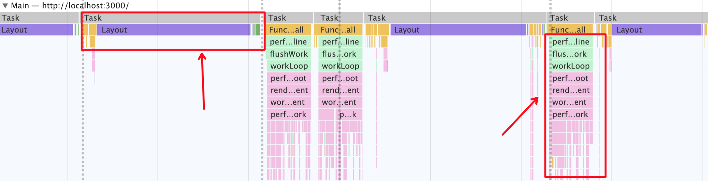

# react源码分析之调度机制(一)

## 引言
Scheduler作为一个独立的包，可以独自承担起任务调度的职责，你只需要将任务和任务的调度优先级交给它，它就可以帮你管理任务，安排任务的执行。这就是React和Scheduler配合工作的模式。

对于多个任务，它会先执行调度优先级高的。对于单个任务，它会有节制地去执行。换句话说，线程只有一个，它不会一直占用着线程去执行任务。而是执行一会，中断一下，如此往复。用这样的模式，来避免一直占用有限的资源执行耗时较长的任务，解决用户操作时页面卡顿的问题，实现更快的响应。

本次分享从三个方面入手：任务队列管理、单个任务的执行控制、多个任务的执行控制

## 基本概念
为了实现上述的两个行为，它引入三个概念：任务优先级 、 任务调度优先级、时间片。

### 任务优先级
任务优先级决定任务在React中被如何调度，分为三类：

1. 同步优先级：React传统的同步渲染模式产生的更新任务所持有的优先级
2. 同步批量优先级：同步模式到concurrent模式过渡模式：blocking模式（介绍）产生的更新任务所持有的优先级
3. concurrent模式下的优先级：concurrent模式产生的更新持有的优先级
```js
export const SyncLane: Lane = /*                        */ 0b0000000000000000000000000000001;
export const SyncBatchedLane: Lane = /*                 */ 0b0000000000000000000000000000010;

concurrent模式下的lanes：/*                               */ 0b1111111111111111111111111111100;
```

### 任务调度优先级
即是Scheduler中的优先级，任务调度优先级决定Scheduler何时去处理这个任务，让任务按照自身的紧急程度排序，这样可以让优先级最高的任务最先被执行到。

目前有6中优先级（从高到低排序）：

* 立即执行ImmediatePriority	React内部使用：过期任务立即同步执行；用户自定义使用
* 用户与页面交互UserBlockingPriority	React内部使用：用户交互事件生成此优先级任务；用户自定义使用
* 普通NormalPriority	React内部使用：默认优先级；用户自定义使用
* 低LowPriority	用户自定义使用
* 空闲IdlePriority	用户自定义使用
* 无NoPriority	React内部使用：初始化和重置root；用户自定义使用

上面列出了优先级类型和使用场景。React内部用到了除低优先级和空闲优先级以外的优先级。理论上，用户可以自定义使用所有优先级，使用方法:
```js
React.unstable_scheduleCallback(priorityLevel, callback, { timeout: <number> })
```
注意区分：任务优先级决定着任务在React中被如何调度，而由任务优先级转化成的任务调度优先级，决定着Scheduler何时去处理这个任务。

### 时间片
时间片规定的是单个任务在这一帧内最大的执行时间，任务一旦执行时间超过时间片，则会被打断，有节制地执行任务。这样可以保证页面不会因为任务连续执行的时间过长而产生卡顿。

## 原理概述
### 任务队列管理
在Scheduler内部，把任务分成了两种：未过期的和已过期的，分别用两个队列存储，前者存到timerQueue中，后者存到taskQueue中。

#### 如何区分任务是否过期？
用任务的开始时间（startTime）和当前时间（currentTime）作比较。

1. 开始时间大于当前时间，说明未过期，放到timerQueue；
2. 开始时间小于等于当前时间，说明已过期，放到taskQueue。

#### 不同队列中的任务如何排序？
当任务一个个入队的时候，自然要对它们进行排序，保证紧急的任务排在前面，所以排序的依据就是任务的紧急程度。而taskQueue和timerQueue中任务紧急程度的判定标准是有区别的。

taskQueue中，依据任务的过期时间（expirationTime）排序，过期时间越早，说明越紧急，过期时间小的排在前面。过期时间根据任务调度优先级计算得出，越高，过期时间越早。

timerQueue中，依据任务的开始时间（startTime）排序，开始时间越早，说明会越早开始，开始时间小的排在前面。任务进来的时候，开始时间默认是当前时间，如果进入调度的时候传了延迟时间，开始时间则是当前时间与延迟时间的和。

#### 任务入队两个队列，之后呢？
如果放到了taskQueue，那么立即调度一个函数去循环taskQueue，挨个执行里面的任务。

如果放到了timerQueue，那么说明它里面的任务都不会立即执行，那就等到了timerQueue里面排在第一个任务的开始时间，看这个任务是否过期，如果是，则把任务从timerQueue中拿出来放入taskQueue，调度一个函数去循环它，执行掉里面的任务；否则过一会继续检查这第一个任务是否过期。

任务队列管理利用任务的调度优先级去管理任务队列中的任务顺序，始终让最紧急的任务被优先处理。

### 单个任务的执行控制
在循环taskQueue执行每一个任务时，如果某个任务执行时间过长，达到了时间片限制的时间，那么该任务必须中断，以便于让位给更重要的事情（如浏览器绘制），等事情完成，再恢复执行任务。

举例：

点击按钮渲染140000个DOM节点，为的是让React通过scheduler调度一个耗时较长的更新任务。同时拖动方块，这是为了模拟用户交互。更新任务会占用线程去执行任务，用户交互要也要占用线程去响应页面，这就决定了它们两个是互斥的关系。

执行React任务和页面响应交互这两件事情是互斥的，但因为Scheduler可以利用时间片中断React任务，然后让出线程给浏览器去绘制，所以一开始在fiber树的构建阶段，拖动方块会得到及时的反馈。但是后面卡了一下，这是因为fiber树构建完成，进入了同步的commit阶段，导致交互卡顿。分析页面的渲染过程可以非常直观地看到通过时间片的控制。

1. 主线程被让出去进行页面的绘制（Painting和Rendering，绿色和紫色的部分）。
2. React构建fiber树的任务

Scheduler要实现这样的调度效果需要两个角色：任务的调度者、任务的执行者。

调度者调度一个执行者，执行者去循环taskQueue，逐个执行任务。当某个任务的执行时间比较长，执行者会根据时间片中断任务执行，然后告诉调度者：我现在正执行的这个任务被中断了，还有一部分没完成，但现在必须让位给更重要的事情，你再调度一个执行者吧，好让这个任务能在之后被继续执行完（任务的恢复）。于是，调度者知道了任务还没完成，需要继续做，它会再调度一个执行者去继续完成这个任务。

通过执行者和调度者的配合，可以实现任务的中断和恢复。

### 多个任务的执行控制
举例：

有这样一个组件，state为0，进入页面，会调用setState将state加1，这个作为低优先级任务。React开始进行更新，在这个低优先级任务尚未完成时，模拟按钮点击，state加2，这个作为高优先级任务。页面上的数字变化为0 -> 2 -> 3，而不是0 -> 1 -> 3。这就说明，当低优先级任务（加1）正在进行时，高优先级任务进来了，而它会把state设置为2。由于高优先级任务的插队，设置state为1的低优先级任务会被取消，先做高优先级任务，所以数字从0变成了2。而高优先级任务完成之后，低优先级任务会被重做，所以state再从2加到了3。

https://segmentfault.com/img/remote/1460000039008913

当调用setState时，意味着组件对应的fiber节点产生了一个更新。setState实际上是生成一个update对象，将这个update对象连接到fiber节点的updateQueue链表中，准备本次任务调度协调所需要的lanes和任务优先级，然后判断是否真的需要调度，根据任务优先级去调度任务，高优先级进来打断了低优先级，先做高优先级，当处理更新时，只处理优先级足够的update，跳过那些优先级不足的update，并将不足的update-lane收集起来，表示在本轮更新后，仍然有任务未被处理，在commit阶段最后重新发起调度，从而实现低优先级任务被重新调度。

## 总结
以上是对react调度机制的原理概括，源码解析请期待！
