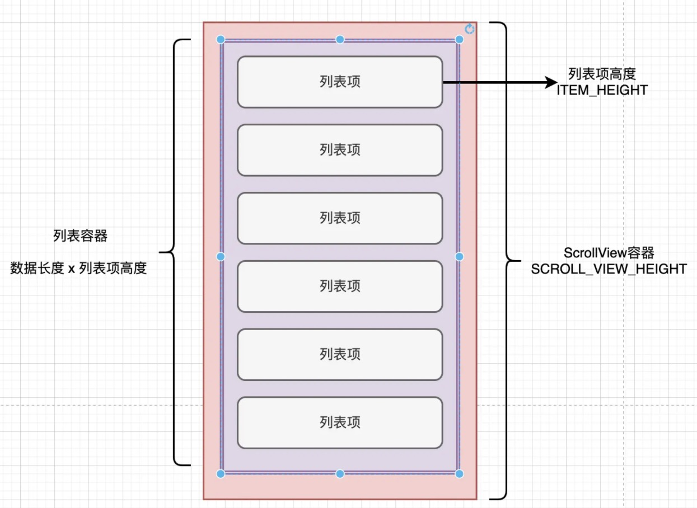
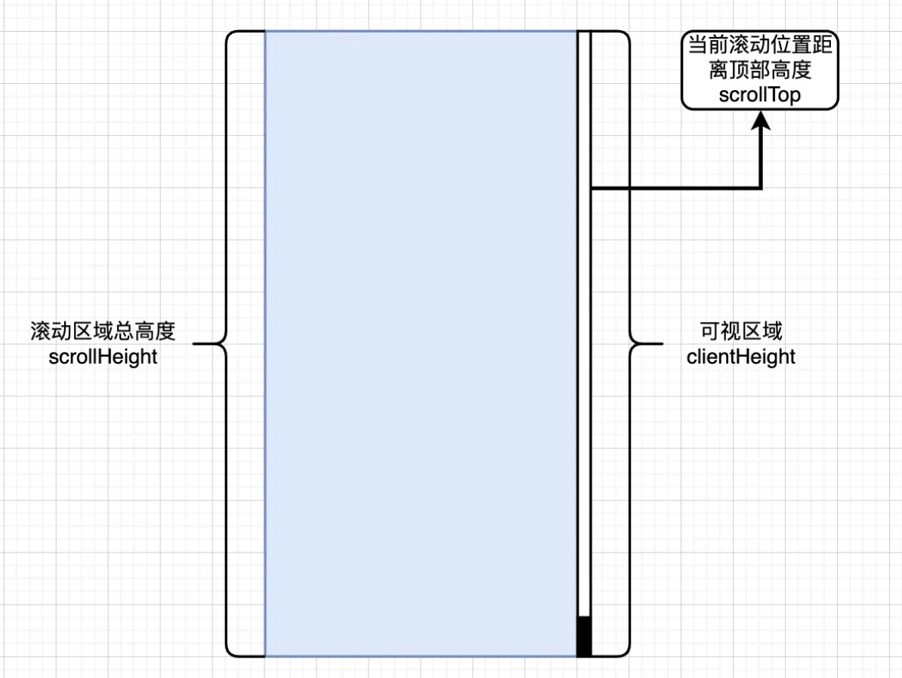

# 长列表渲染优化

## 引言
在商城项目当中，长列表渲染出现的页面都与用户密切相关，如订单列表、优惠券列表、购物车等都是我们日常生活中经常浏览的一些页面，因此长列表渲染的性能效率与用户体验两者是成正比的。

而在长列表页面做性能优化和开发设计的时候，我们大多数会碰到以下两个问题：
1. 数据过多，首次展示内容时间过长，接口返回数据过多，页面数据不好处理。
2. DOM元素过多，页面渲染卡顿、操作不流畅，浏览器性能压力重。

建议使用分页加载+虚拟列表的方案


## 分析原因

* 分页加载：解决了数据过多问题，通过数据分页的方式减少了首次页面加载的数据和DOM数量。是现今绝大部分的应用都会采用的实施手段。随着页面浏览的页面数据增多，DOM数量也越来越多，还是会存在部分问题。
* 分片加载：与分页加载相同，只是将用户触底行为获取最新数据的时间节点在一开始进行了切片加载，优先显示页面数据在加载其他数据。会出现页面阻塞和性能问题。
* 虚拟列表：将驱动交给数据，通过区间来直接渲染区间内容中的数据DOM，解决了页面列表内元素过多操作卡顿的问题, 与数据加载无挂钩。

单一的方案很难满足我们的诉求。因此，选择使用分页的方式处理数据加载，同时将渲染页面的事情交给虚拟列表进行渲染。通过结合两种不同侧重点的方案，来满足我们初步的诉求。

## 虚拟列表

将整体列表划分为滚动窗口和可视窗口。左边是真实的列表，所有的列表项都是真实的DOM元素，而虚拟列表从图中可以看到，只有出现在可视窗口内的列表项才是真实的DOM元素，而未出现在可视窗口中的元素则只是虚拟数据，并未加载到页面上。

```
与真实列表不同的是，虚拟列表的滚动都是通过transform或者是marginTop做的偏移量，本身列表中只显示视窗区的DOM元素。
```


### 基本布局

* 第一层为容器层，选定一个固定高度，也就是我们说的可视化窗口
* 第二层为内容层，一般在这里撑开高度，使容器形成scroll。
* 第三层为子内容层，居于内容层内部，也就是列表中的列表项。
* ......



### 初始化页面

#### 页面属性：

* 容器高度：当前虚拟列表的高度
* 列表项高度： 列表项的高度
* 预加载偏移：可视窗上下做预加载时需要额外展示几个预备内容

```js
/** @name 页面容器高度 */
const SCROLL_VIEW_HEIGHT: number = 500;

/** @name 列表项高度 */
const ITEM_HEIGHT: number = 50;

/** @name 预加载数量 */
const PRE_LOAD_COUNT: number = SCROLL_VIEW_HEIGHT / ITEM_HEIGHT;
```

创建一个useRef用来存储元素，然后获取视窗高度和偏移属性。
```js
/** 容器Ref */
const containerRef = useRef<HTMLDivElement | null>(null);
```

创建数据源，并且生成3000条随机数据做显示处理。
```js
const [sourceData, setSourceData] = useState<number[]>([]);

/**
 * 创建列表显示数据
 */
const createListData = () => {
  const initnalList: number[] = Array.from(Array(4000).keys());
  setSourceData(initnalList);
};

useEffect(() => {
  createListData();
}, []);
```

为相对应的容器绑定高度。在最外层div标签设置高度为SCROLL_VIEW_HEIGHT，对列表div的高度则设置为sourceData.length * ITEM_HEIGHT。

#### 获取列表整体高度
```js
/**
 * scrollView整体高度
 */
 const scrollViewHeight = useMemo(() => {
  return sourceData.length * ITEM_HEIGHT;
}, [sourceData]);
```

#### 绑定页面视图
```js
<div
  ref={containerRef}
  style={{
    height: SCROLL_VIEW_HEIGHT,
    overflow: "auto",
  }}
  onScroll={onContainerScroll}
>
  <div
    style={{
      width: "100%",
      height: scrollViewHeight - scrollViewOffset,
      marginTop: scrollViewOffset,
    }}
  >
    {sourceData.map((e) => (
      <div
        style={{
          height: ITEM_HEIGHT,
        }}
        className="showElement"
        key={e}
      >
        Current Position: {e}
      </div>
    ))}
  </div>
</div>;
```

### 内容截取
对于虚拟列表来说，并不需要全量将数据渲染在页面上。那么，在这里我们就要开始做数据截取的工作了。

首先，如下图，我们通过showRange来控制页面显示元素的数量。通过Array.slice的函数方法对sourceData进行数据截取, 返回值就是我们在页面上去显示的列表数据了。我将上面代码中直接遍历souceData换成我们的新数据列表。如下：
```js
{currentViewList.map((e) => (
  <div
    style={{
      height: ITEM_HEIGHT
    }}
    className="showElement"
    key={e.data}
  >
    Current Position: {e.data}
  </div>
))}
```

currentViewList是一个useMemo的返回值，它会随着showRange和sourceData的更新发生变化。
```js
/**
 * 当前scrollView展示列表
 */
 const currentViewList = useMemo(() => {
  return sourceData.slice(showRange.start, showRange.end).map((el, index) => ({
    data: el,
    index,
  }));
}, [showRange, sourceData]);
```


### 滚动计算

监听视窗滚动事件来计算showRange中的start和end的偏移量，同时调整对应的滚动条进度来实现一个真正的列表效果。

滚动视窗(scrollContainer)绑定onScroll事件，也就是下面的onContainerScroll函数方法。计算当前showRange中的start和end所处位置，同时更新页面视图数据。
```js
/**
 * onScroll事件回调
 * @param event { UIEvent<HTMLDivElement> } scrollview滚动参数
 */
 const onContainerScroll = (event: UIEvent<HTMLDivElement>) => {
  event.preventDefault();
  calculateRange();
};
```

首先，通过containerRef.current.scrollTop可以知道元素滚动条内的顶部隐藏列表的高度，然后使用Math.floor方法向下取整后，来获取当前偏移的元素数量，在减去一开始的上下文预加载数量PRE_LOAD_COUNT，就可以得出截取内容开始的位置。

其次，通过containerRef.current.clientHeight可以获取滚动视窗的高度，那么通过containerRef.current.clientHeight / ITEM_HEIGHT这个公式就可以得出当前容器窗口可以容纳几个列表项。

当我通过当前滚动条位置下之前滚动的元素个数且已经计算出截取窗口的起始位置后，就可以通过启动位置 + 容器显示个数 + 预加载个数这个公式计算出了当前截取窗口的结束位置。使用setShowPageRange方法更新新的位置下标后，当我上下滑动窗口，显示的数据会根据showRange切割成为不同的数据渲染在页面上。   
```js
/**
 * 计算元素范围
 */
 const calculateRange = () => {
  const element = containerRef.current;
  if (element) {
    const offset: number = Math.floor(element.scrollTop / ITEM_HEIGHT) + 1;
    console.log(offset, "offset");
    const viewItemSize: number = Math.ceil(element.clientHeight / ITEM_HEIGHT);
    const startSize: number = offset - PRE_LOAD_COUNT;
    const endSize: number = viewItemSize + offset + PRE_LOAD_COUNT;
    setShowPageRange({
      start: startSize < 0 ? 0 : startSize,
      end: endSize > sourceData.length ? sourceData.length : endSize,
    });
  }
};
```

### 滚动条偏移
提到会根据containerRef.current.scrollTop计算当前滚动过的高度。那么问题来了，页面上其实并没有真实的元素，又该如何去撑开这个高度呢？

目前而言，比较流行的解决方案分为MarinTop和TranForm做距离顶部的偏移来实现高度的撑开。
1. margin是属于布局属性，该属性的变化会导致页面的重排
2. transform是合成属性，浏览器会为元素创建一个独立的复合层，当元素内容没有发生变化，该层不会被重绘，通过重新复合来创建动画帧。

两种方案并没有太大的区别，都可以用来实现距离顶部位置的偏移，达到撑开列表实际高度的作用。

下面，我就以MarinTop的方法来处理这个问题，来完善当前的虚拟列表。

首先，我们需要计算出列表页面距离顶部的MarginTop的距离，通过公式：当前虚拟列表的起始位置 * 列表项高度，我们可以计算出当前的scrollTop距离。通过useMemo将逻辑做一个缓存处理，依赖项为showRange.start, 当showRange.start发生变化时会更新marginTop的高度计算。
```js
/**
 * scrollView 偏移量
 */
 const scrollViewOffset = useMemo(() => {
  console.log(showRange.start, "showRange.start");
  return showRange.start * ITEM_HEIGHT;
}, [showRange.start]);
```

在页面上为列表窗口绑定marginTop: scrollViewOffset属性，并且在总高度中减去scrollViewOffset来维持平衡，防止多出距离的白底。
```js
<div
    style={{
        width: "100%",
        height: scrollViewHeight - scrollViewOffset,
        marginTop: scrollViewOffset
    }}
>
```

## 结合分页加载
当我们有了一个虚拟列表后，就可以尝试结合分页加载来实现一个懒加载的长虚拟列表了。

### 判断是否到底部
想要实现列表的分页加载，我们需要绑定onScroll事件来判断当前滚动视窗是否滚动到了底部，当滚动到底部后需要为sourceData进行数据的添加。同时将挪动指针，将数据指向下一个起始点。

reachScrollBottom函数的返回值是当前滚动窗口是否已经到达了底部。因此，我们通过函数的返回值进行条件判断。到达底部后，我们模拟一批数据后通过setSourceData设置源数据。结束之后在执行calculateRange重新设置内容截取的区间。
```js
/**
 * onScroll事件回调
 * @param event { UIEvent<HTMLDivElement> } scrollview滚动参数
 */
 const onContainerScroll = (event: UIEvent<HTMLDivElement>) => {
  event.preventDefault();
  if (reachScrollBottom()) {
    // 模拟数据添加，实际上是 await 异步请求做为数据的添加
    let endIndex = showRange.end;
    let pushData: number[] = [];
    for (let index = 0; index < 20; index++) {
      pushData.push(endIndex++);
    }
    setSourceData((arr) => {
      return [...arr, ...pushData];
    });
  }
  calculateRange();
};
```


通过三者的关系，可以得出条件公式：scrollTop + clientHeight >= scrollHeight，满足这个条件就说明当前窗口已经到达底部。
```js
/**
 * 计算当前是否已经到底底部
 * @returns 是否到达底部
 */
 const reachScrollBottom = (): boolean => {
  //滚动条距离顶部
  const contentScrollTop = containerRef.current?.scrollTop || 0; 
  //可视区域
  const clientHeight = containerRef.current?.clientHeight || 0; 
  //滚动条内容的总高度
  const scrollHeight = containerRef.current?.scrollHeight || 0;
  if (contentScrollTop + clientHeight >= scrollHeight) {
    return true;
  }
  return false;
};
```

## 完整代码
```js
import React, { useEffect, useState, useMemo, useRef } from 'react';
import './index.less';  

/** @name 页面容器高度 */
const SCROLL_VIEW_HEIGHT = 500;

/** @name 列表项高度 */
const ITEM_HEIGHT = 50;

/** @name 预加载数量 */
const PRE_LOAD_COUNT = SCROLL_VIEW_HEIGHT / ITEM_HEIGHT;

export default function WorkBench() {
  const containerRef = useRef(null);
  const [sourceData, setSourceData] = useState([]);
  const [showRange, setShowPageRange] = useState({start:0})
  
  useEffect(() => {
    createListData();
  }, []);

  /**
   * 创建列表显示数据
   */
  const createListData = () => {
    const initnalList = Array.from(Array(50).keys());
    setSourceData(initnalList);
  };

  /**
   * 当前scrollView展示列表
   */
  const currentViewList = useMemo(() => {
    return sourceData.slice(showRange.start, showRange.end).map((el, index) => ({
      data: el,
      index,
    }));
  }, [showRange, sourceData]);

  /**
   * scrollView整体高度
   */
  const scrollViewHeight = useMemo(() => {
    return sourceData.length * ITEM_HEIGHT;
  }, [sourceData]);

  /**
   * scrollView 偏移量
   */
  const scrollViewOffset = useMemo(() => {
    console.log(showRange.start, "showRange.start");
    return showRange.start * ITEM_HEIGHT;
  }, [showRange.start]);

  /**
   * onScroll事件回调
   * @param event { UIEvent<HTMLDivElement> } scrollview滚动参数
   */
  const onContainerScroll = (event) => {
    event.preventDefault();
    if (reachScrollBottom()) {
      // 模拟数据添加，实际上是 await 异步请求做为数据的添加
      let endIndex = showRange.end;
      let pushData = [];
      for (let index = 0; index < 20; index++) {
        pushData.push(endIndex++);
      }
      setSourceData((arr) => {
        return [...arr, ...pushData];
      });
    }
    calculateRange();
  };

  /**
   * 计算元素范围
   */
  const calculateRange = () => {
    const element = containerRef.current;
    if (element) {
      const offset = Math.floor(element.scrollTop / ITEM_HEIGHT) + 1;
      console.log(offset, "offset");
      const viewItemSize = Math.ceil(element.clientHeight / ITEM_HEIGHT);
      const startSize = offset - PRE_LOAD_COUNT;
      const endSize = viewItemSize + offset + PRE_LOAD_COUNT;
      setShowPageRange({
        start: startSize < 0 ? 0 : startSize,
        end: endSize > sourceData.length ? sourceData.length : endSize,
      });
    }
  };

  /**
   * 计算当前是否已经到底底部
   * @returns 是否到达底部
   */
  const reachScrollBottom = () => {
    //滚动条距离顶部
    const contentScrollTop = containerRef.current?.scrollTop || 0; 
    //可视区域
    const clientHeight = containerRef.current?.clientHeight || 0; 
    //滚动条内容的总高度
    const scrollHeight = containerRef.current?.scrollHeight || 0;
    if (contentScrollTop + clientHeight >= scrollHeight) {
      return true;
    }
    return false;
  };

  return (
    <section className="work-bench" onContextMenu={e => {
      e.preventDefault();
    }}>
      <div
        ref={containerRef}
        style={{
          height: SCROLL_VIEW_HEIGHT,
          overflow: "auto",
          margin: '0 auto',
          width: 300
        }}
        onScroll={onContainerScroll}
      >
        <div
          style={{
            width: "100%",
            height: scrollViewHeight - scrollViewOffset,
            marginTop: scrollViewOffset,
          }}
        >
          {currentViewList.map((e) => (
            <div
              style={{
                height: ITEM_HEIGHT
              }}
              className="showElement"
              key={e.data}
            >
              Current Position: {e.data}
            </div>
          ))}
        </div>
      </div>
    </section>
  );
}
```

## 总结
这个方案还有很多需要完善的地方，我也在这里说说它需要优化的地方。
1. 滚动事件可以添加节流事件避免造成性能浪费。
2. 列表项高度不固定需要给定一个默认高度后设置新的高度在重新刷新容易截取的开始和结束位置。
3. 滑动过快出现白屏问题可以尝试动态加载loading显示过渡，优化一些细节体验。
4. 列表项中存在阴影元素需要考虑缓存处理，不然滚动时必然会引起重新加载。

市面上已经有很多开源库可以解决这些问题，如react中ahooks就有相对完善的虚拟列表实践，本文的代码相对而言也是对其的源码分析。
