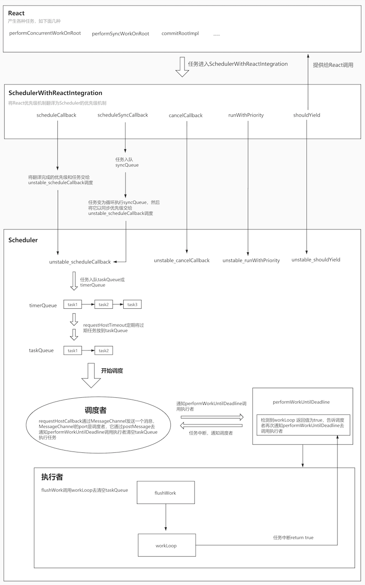
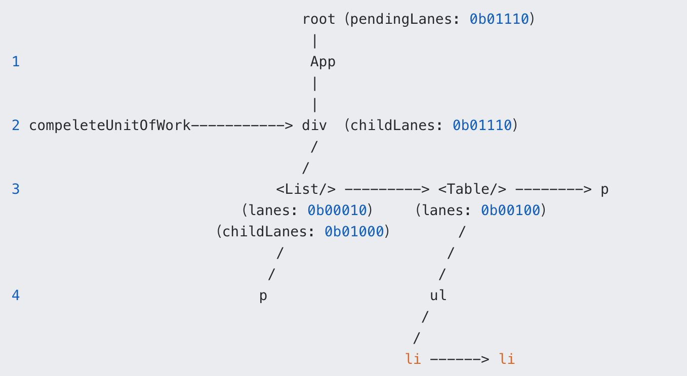

# react源码分析之调度机制(二)

## 引言
之前对react调度机制的原理进行了概述，下面就让我们来分析下它的具体流程

## 详细流程
React和Scheduler它们二者构成的一个系统的示意图。



### React与Scheduler的连接
Scheduler帮助React调度各种任务，但是本质上它们是两个完全不耦合的东西，二者各自都有自己的优先级机制，那么这时就需要有一个中间角色将它们连接起来。

react-reconciler中提供了这样一个文件专门去做这样的工作，就是SchedulerWithReactIntegration.old(new).js。它将二者的优先级翻译了一下，让React和Scheduler能读懂对方。另外，封装了一些Scheduler中的函数供React使用。

在执行React任务的重要文件ReactFiberWorkLoop.js中，关于Scheduler的内容都是从SchedulerWithReactIntegration.old(new).js导入的。它可以理解成是React和Scheduler之间的桥梁。
```js
// ReactFiberWorkLoop.js
import {
  scheduleCallback,
  cancelCallback,
  getCurrentPriorityLevel,
  runWithPriority,
  shouldYield,
  requestPaint,
  now,
  NoPriority as NoSchedulerPriority,
  ImmediatePriority as ImmediateSchedulerPriority,
  UserBlockingPriority as UserBlockingSchedulerPriority,
  NormalPriority as NormalSchedulerPriority,
  flushSyncCallbackQueue,
  scheduleSyncCallback,
} from './SchedulerWithReactIntegration.old';
```
SchedulerWithReactIntegration.old(new).js通过封装Scheduler的内容，对React提供两种调度入口函数：scheduleCallback 和 scheduleSyncCallback。任务通过调度入口函数进入调度流程。

### 调度准备
React的更新入口是scheduleUpdateOnFiber，它区分update的lane，将同步更新和异步更新分流，让二者进入各自的流程。但在此之前，它会做几个比较重要的工作：

* 检查是否是无限更新，例如在render函数中调用了setState。
* 从产生更新的节点开始，往上一直循环到root，目的是将fiber.lanes一直向上收集，收集到父级节点的childLanes中，childLanes是识别这个fiber子树是否需要更新的关键。
* 在root上标记更新，也就是将update的lane放到root.pendingLanes中，每次渲染的优先级基准：renderLanes就是取自root.pendingLanes中最紧急的那一部分lanes。

scheduleUpdateOnFiber最终会调用ensureRootIsScheduled，来让React任务被调度，这是一个非常重要的函数。

```js
防止死循环卡死的情况。

如果fiber.lanes不为空，则说明该fiber节点有更新，而fiber.childLanes是判断当前子树是否有更新的重要依据，若有更新，则继续向下构建，否则直接复用已有的fiber树，就不往下循环了，可以屏蔽掉那些无需更新的fiber节点。

将当前update对象的lane加入到root.pendingLanes中，保证真正开始做更新任务的时候，获取到update的lane，从而作为本次更新的渲染优先级（renderLanes），去更新。

export function scheduleUpdateOnFiber(
  fiber: Fiber,
  lane: Lane,
  eventTime: number,
) {
  // 第一步，检查是否有无限更新
  checkForNestedUpdates();

  ...
  // 第二步，向上收集fiber.childLanes
  const root = markUpdateLaneFromFiberToRoot(fiber, lane);

  ...

  // 第三步，在root上标记更新，将update的lane放到root.pendingLanes
  markRootUpdated(root, lane, eventTime);

  ...

  // 根据Scheduler的优先级获取到对应的React优先级
  const priorityLevel = getCurrentPriorityLevel();

  if (lane === SyncLane) {
    // 本次更新是同步的，例如传统的同步渲染模式
    if (
      (executionContext & LegacyUnbatchedContext) !== NoContext &&
      (executionContext & (RenderContext | CommitContext)) === NoContext
    ) {
      // 如果是本次更新是同步的，并且当前还未渲染，意味着主线程空闲，并没有React的
      // 更新任务在执行，那么调用performSyncWorkOnRoot开始执行同步任务

      ...

      performSyncWorkOnRoot(root);
    } else {
      // 如果是本次更新是同步的，不过当前有React更新任务正在进行，
      // 而且因为无法打断，所以调用ensureRootIsScheduled
      // 目的是去复用已经在更新的任务，让这个已有的任务
      // 把这次更新顺便做了
      ensureRootIsScheduled(root, eventTime);
      ...
    }
  } else {

    ...

    // Schedule other updates after in case the callback is sync.
    // 如果是更新是异步的，调用ensureRootIsScheduled去进入异步调度
    ensureRootIsScheduled(root, eventTime);
    schedulePendingInteractions(root, lane);
  }

  ...
}
```

### 任务调度协调 - ensureRootIsScheduled
React这边对任务的调度本质上其实是以任务优先级为基准，去操作多个或单个任务。

任务本身是由更新产生的，因此任务优先级本质上是和update的优先级，即update.lane有关（只是有关，不一定是由它而来）。得出的任务优先级属于lanePriority，它不是update的lane，而且与scheduler内部的调度优先级是两个概念。

在 调度准备 的最后提到过，update.lane会被放入root.pendingLanes，随后会获取root.pendingLanes中最优先级的那些lanes作为renderLanes。任务优先级的生成就发生在计算renderLanes的阶段。

任务优先级其实就是renderLanes对应的lanePriority。因为renderLanes是本次更新的优先级基准，所以它对应的lanePriority被作为任务优先级来衡量本次更新任务的优先级权重理所应当。
```
root.pendingLanes，包含了当前fiber树中所有待处理的update的lane。

计算renderLanes的函数是getNextLanes，生成任务优先级的函数是getHighestPriorityLanes
```
多个任务的情况，相对于新任务，会对现有任务进行或复用，或取消的操作，单个任务的情况，对任务进行或同步，或异步，或批量同步 的调度决策，这种行为可以看成是一种任务调度协调机制，这种协调通过ensureRootIsScheduled去实现。

先是准备本次任务调度协调所需要的lanes和任务优先级，然后判断是否真的需要调度

* 获取root.callbackNode，即旧任务
* 检查任务是否过期，将过期任务放入root.expiredLanes，目的是让过期任务能够以同步优先级去进入调度（立即执行）
* 获取renderLanes（优先从root.expiredLanes获取），如果renderLanes是空的，说明不需要调度，直接return掉
* 获取本次任务，即新任务的优先级：newCallbackPriority

```js
首先判断是否有必要发起一次新调度，方法是通过比较新任务的优先级和旧任务的优先级是否相等：

相等，则说明无需再次发起一次调度，直接复用旧任务即可，让旧任务在处理更新的时候顺便把新任务给做了。
不相等，则说明新任务的优先级一定高于旧任务，这种情况就是高优先级任务插队，需要把旧任务取消掉。
真正发起调度，看新任务的任务优先级：

同步优先级：调用scheduleSyncCallback去同步执行任务。
同步批量执行：调用scheduleCallback将任务以立即执行的优先级去加入调度。
属于concurrent模式的优先级：调用scheduleCallback将任务以上面获取到的新任务优先级去加入调度。
function ensureRootIsScheduled(root: FiberRoot, currentTime: number) {
  // 获取旧任务
  const existingCallbackNode = root.callbackNode;

  // 记录任务的过期时间，检查是否有过期任务，有则立即将它放到root.expiredLanes，
  // 便于接下来将这个任务以同步模式立即调度
  markStarvedLanesAsExpired(root, currentTime);

  // 获取renderLanes
  const nextLanes = getNextLanes(
    root,
    root === workInProgressRoot ? workInProgressRootRenderLanes : NoLanes,
  );

  // 获取renderLanes对应的任务优先级
  const newCallbackPriority = returnNextLanesPriority();

  if (nextLanes === NoLanes) {
    // 如果渲染优先级为空，则不需要调度
    if (existingCallbackNode !== null) {
      cancelCallback(existingCallbackNode);
      root.callbackNode = null;
      root.callbackPriority = NoLanePriority;
    }
    return;
  }

  // 如果存在旧任务，那么看一下能否复用
  if (existingCallbackNode !== null) {

    // 获取旧任务的优先级
    const existingCallbackPriority = root.callbackPriority;

    // 如果新旧任务的优先级相同，则无需调度
    if (existingCallbackPriority === newCallbackPriority) {
      return;
    }
    // 代码执行到这里说明新任务的优先级高于旧任务的优先级
    // 取消掉旧任务，实现高优先级任务插队
    cancelCallback(existingCallbackNode);
  }

  // 调度一个新任务
  let newCallbackNode;
  if (newCallbackPriority === SyncLanePriority) {

    // 若新任务的优先级为同步优先级，则同步调度，传统的同步渲染和过期任务会走这里
    newCallbackNode = scheduleSyncCallback(
      performSyncWorkOnRoot.bind(null, root),
    );
  } else if (newCallbackPriority === SyncBatchedLanePriority) {

    // 同步模式到concurrent模式的过渡模式：blocking模式会走这里
    newCallbackNode = scheduleCallback(
      ImmediateSchedulerPriority,
      performSyncWorkOnRoot.bind(null, root),
    );
  } else {
    // concurrent模式的渲染会走这里

    // 根据任务优先级获取Scheduler的调度优先级
    const schedulerPriorityLevel = lanePriorityToSchedulerPriority(
      newCallbackPriority,
    );

    // 计算出调度优先级之后，开始让Scheduler调度React的更新任务
    newCallbackNode = scheduleCallback(
      schedulerPriorityLevel,
      performConcurrentWorkOnRoot.bind(null, root),
    );
  }

  // 更新root上的任务优先级和任务，以便下次发起调度时候可以获取到
  root.callbackPriority = newCallbackPriority;
  root.callbackNode = newCallbackNode;
}
```

scheduleCallback和scheduleSyncCallback其实都是对Scheduler中scheduleCallback的封装，只不过传入的优先级不同而已。

scheduleCallback是传递的是已经本次更新的lane计算得出的调度优先级，scheduleSyncCallback传递的是最高级别的优先级。

scheduleCallback直接将任务交给Scheduler，而scheduleSyncCallback先将任务放到SchedulerWithReactIntegration.old(new).js自己的同步队列中，再将执行同步队列的函数交给Scheduler，以最高优先级进行调度，由于传入了最高优先级，意味着它将会是立即过期的任务，会立即执行掉它，这样能够保证在下一次事件循环中执行掉任务。
```js
function scheduleCallback(
  reactPriorityLevel: ReactPriorityLevel,
  callback: SchedulerCallback,
  options: SchedulerCallbackOptions | void | null,
) {
  // 将react的优先级翻译成Scheduler的优先级
  const priorityLevel = reactPriorityToSchedulerPriority(reactPriorityLevel);
  // 调用Scheduler的scheduleCallback，传入优先级进行调度
  return Scheduler_scheduleCallback(priorityLevel, callback, options);
}

function scheduleSyncCallback(callback: SchedulerCallback) {
  if (syncQueue === null) {
    syncQueue = [callback];
    // 以最高优先级去调度刷新syncQueue的函数
    immediateQueueCallbackNode = Scheduler_scheduleCallback(
      Scheduler_ImmediatePriority,
      flushSyncCallbackQueueImpl,
    );
  } else {
    syncQueue.push(callback);
  }
  return fakeCallbackNode;
}
```
注意一点，用来做新旧任务比较的优先级与这里将任务加入到scheduler中传入的优先级不是一个，后者可由前者通过lanePriorityToSchedulerPriority转化而来的任务调度优先级。

### 调度入口 - scheduleCallback
Scheduler中的scheduleCallback是调度流程开始的关键点。Scheduler中的任务是形式：
```js
 var newTask = {
    id: taskIdCounter++,
    // 任务函数
    callback,
    // 任务优先级
    priorityLevel,
    // 任务开始的时间
    startTime,
    // 任务的过期时间
    expirationTime,
    // 在小顶堆队列中排序的依据
    sortIndex: -1,
  };
```
* callback：真正的任务函数，重点，也就是外部传入的任务函数，例如构建fiber树的任务函数：performConcurrentWorkOnRoot
* priorityLevel：任务优先级，参与计算任务过期时间
* startTime：表示任务开始的时间，影响它在timerQueue中的排序
* expirationTime：表示任务何时过期，影响它在taskQueue中的排序
* sortIndex：在小顶堆队列中排序的依据，在区分好任务是过期或非过期之后，sortIndex会被赋值为expirationTime或startTime，为两个小顶堆的队列（taskQueue,timerQueue）提供排序依据
真正的重点是callback，作为任务函数，它的执行结果会影响到任务完成状态的判断

scheduleCallback做的事情：它负责生成调度任务、根据任务是否过期将任务放入timerQueue或taskQueue，然后触发调度行为，让任务进入调度。
```js
function unstable_scheduleCallback(priorityLevel, callback, options) {
  // 获取当前时间，它是计算任务开始时间、过期时间和判断任务是否过期的依据
  var currentTime = getCurrentTime();
  // 确定任务开始时间
  var startTime;
  // 从options中尝试获取delay，也就是推迟时间
  if (typeof options === 'object' && options !== null) {
    var delay = options.delay;
    if (typeof delay === 'number' && delay > 0) {
      // 如果有delay，那么任务开始时间就是当前时间加上delay
      startTime = currentTime + delay;
    } else {
      // 没有delay，任务开始时间就是当前时间，也就是任务需要立刻开始
      startTime = currentTime;
    }
  } else {
    startTime = currentTime;
  }

  // 计算timeout
  var timeout;
  switch (priorityLevel) {
    case ImmediatePriority:
      timeout = IMMEDIATE_PRIORITY_TIMEOUT; // -1
      break;
    case UserBlockingPriority:
      timeout = USER_BLOCKING_PRIORITY_TIMEOUT; // 250
      break;
    case IdlePriority:
      timeout = IDLE_PRIORITY_TIMEOUT; // 1073741823 ms
      break;
    case LowPriority:
      timeout = LOW_PRIORITY_TIMEOUT; // 10000
      break;
    case NormalPriority:
    default:
      timeout = NORMAL_PRIORITY_TIMEOUT; // 5000
      break;
  }
  // 计算任务的过期时间，任务开始时间 + timeout
  // 若是立即执行的优先级（ImmediatePriority），
  // 它的过期时间是startTime - 1，意味着立刻就过期
  var expirationTime = startTime + timeout;

  // 创建调度任务
  var newTask = {
    id: taskIdCounter++,
    // 真正的任务函数，重点
    callback,
    // 任务优先级
    priorityLevel,
    // 任务开始的时间，表示任务何时才能执行
    startTime,
    // 任务的过期时间
    expirationTime,
    // 在小顶堆队列中排序的依据
    sortIndex: -1,
  };

  // 下面的if...else判断各自分支的含义是：

  // 如果任务未过期，则将 newTask 放入timerQueue， 调用requestHostTimeout，
  // 目的是在timerQueue中排在最前面的任务的开始时间的时间点检查任务是否过期，
  // 过期则立刻将任务加入taskQueue，开始调度

  // 如果任务已过期，则将 newTask 放入taskQueue，调用requestHostCallback，
  // 开始调度执行taskQueue中的任务
  if (startTime > currentTime) {
    // 任务未过期，以开始时间作为timerQueue排序的依据
    newTask.sortIndex = startTime;
    push(timerQueue, newTask);
    if (peek(taskQueue) === null && newTask === peek(timerQueue)) {
      // 如果现在taskQueue中没有任务，并且当前的任务是timerQueue中排名最靠前的那一个
      // 那么需要检查timerQueue中有没有需要放到taskQueue中的任务，这一步通过调用
      // requestHostTimeout实现
      if (isHostTimeoutScheduled) {
        // 因为即将调度一个requestHostTimeout，所以如果之前已经调度了，那么取消掉
        cancelHostTimeout();
      } else {
        isHostTimeoutScheduled = true;
      }
      // 调用requestHostTimeout实现任务的转移，开启调度
      requestHostTimeout(handleTimeout, startTime - currentTime);
    }
  } else {
    // 任务已经过期，以过期时间作为taskQueue排序的依据
    newTask.sortIndex = expirationTime;
    push(taskQueue, newTask);

    // 开始执行任务，使用flushWork去执行taskQueue
    if (!isHostCallbackScheduled && !isPerformingWork) {
      isHostCallbackScheduled = true;
      requestHostCallback(flushWork);
    }
  }

  return newTask;
}
```

针对未过期任务，会放入timerQueue，并按照开始时间排列，然后调用requestHostTimeout，为的是等一会，等到了timerQueue中那个应该最早开始的任务（排在第一个的任务）的开始时间，再去检查它是否过期，如果它过期则放到taskQueue中，这样任务就可以被执行了，否则继续等。这个过程通过handleTimeout完成。

handleTimeout的职责是：

* 调用advanceTimers，检查timerQueue队列中过期的任务，放到taskQueue中。
* 检查是否已经开始调度，如尚未调度，检查taskQueue中是否已经有任务：

   * 如果有，而且现在是空闲的，说明之前的advanceTimers已经将过期任务放到了taskQueue，那么现在立即开始调度，执行任务
   * 如果没有，而且现在是空闲的，说明之前的advanceTimers并没有检查到timerQueue中有过期任务，那么再次调用requestHostTimeout重复这一过程。

总之，要把timerQueue中的任务全部都转移到taskQueue中执行掉才行。

针对已过期任务，在将它放入taskQueue之后，调用requestHostCallback，让调度者调度一个执行者去执行任务，也就意味着调度流程开始。

### 开始调度-找出调度者和执行者
把flushWork作为入参，那么任务的执行者本质上调用的就是flushWork，我们先不管执行者是如何执行任务的，先关注它是如何被调度的，需要先找出调度者，requestHostCallback的实现：

Scheduler通过调用requestHostCallback让任务进入调度流程。

Scheduler区分了浏览器环境和非浏览器环境，为requestHostCallback做了两套不同的实现。在非浏览器环境下，使用setTimeout实现.
```js
  requestHostCallback = function(cb) {
    if (_callback !== null) {
      setTimeout(requestHostCallback, 0, cb);
    } else {
      _callback = cb;
      setTimeout(_flushCallback, 0);
    }
  };
```

在浏览器环境，用MessageChannel实现。
```js
const channel = new MessageChannel();
  const port = channel.port2;
  channel.port1.onmessage = performWorkUntilDeadline;

  requestHostCallback = function(callback) {
    scheduledHostCallback = callback;
    if (!isMessageLoopRunning) {
      isMessageLoopRunning = true;
      port.postMessage(null);
    }
  };
```

之所以有两种实现，是因为非浏览器环境不存在屏幕刷新率，没有帧的概念，也就不会有时间片，这与在浏览器环境下执行任务有本质区别，因为非浏览器环境基本不胡有用户交互，所以该场景下不判断任务执行时间是否超出了时间片限制，而浏览器环境任务的执行会有时间片的限制。除了这一点之外，虽然两种环境下实现方式不一样，但是做的事情大致相同。

非浏览器环境，它将入参（执行任务的函数）存储到内部的变量_callback上，然后调度_flushCallback去执行这个此变量_callback，taskQueue被清空。

浏览器环境，它将入参（执行任务的函数）存到内部的变量scheduledHostCallback上，然后通过MessageChannel的port去发送一个消息，让channel.port1的监听函数performWorkUntilDeadline得以执行。performWorkUntilDeadline内部会执行掉scheduledHostCallback，最后taskQueue被清空。

通过上面的描述，可以很清楚得找出调度者：非浏览器环境是setTimeout，浏览器环境是port.postMessage。而两个环境的执行者也显而易见，前者是_flushCallback，后者是performWorkUntilDeadline，执行者做的事情都是去调用实际的任务执行函数。

主要探讨浏览器环境下的调度行为，performWorkUntilDeadline涉及到调用任务执行函数去执行任务，这个过程中会涉及任务的中断和恢复、任务完成状态的判断。

### 任务执行 - 从performWorkUntilDeadline说起
performWorkUntilDeadline作为执行者，它的作用是按照时间片的限制去中断任务，并通知调度者再次调度一个新的执行者去继续任务。
```js
const performWorkUntilDeadline = () => {

    if (scheduledHostCallback !== null) {
      // 获取当前时间
      const currentTime = getCurrentTime();

      // 计算deadline，deadline会参与到
      // shouldYieldToHost（根据时间片去限制任务执行）的计算中
      deadline = currentTime + yieldInterval;
      // hasTimeRemaining表示任务是否还有剩余时间，
      // 它和时间片一起限制任务的执行。如果没有时间，
      // 或者任务的执行时间超出时间片限制了，那么中断任务。

      // 它的默认为true，表示一直有剩余时间
      // 因为MessageChannel的port在postMessage，
      // 是比setTimeout还靠前执行的宏任务，这意味着
      // 在这一帧开始时，总是会有剩余时间
      // 所以现在中断任务只看时间片的了
      const hasTimeRemaining = true;
      try {
        // scheduledHostCallback去执行任务的函数，
        // 当任务因为时间片被打断时，它会返回true，表示
        // 还有任务，所以会再让调度者调度一个执行者
        // 继续执行任务
        const hasMoreWork = scheduledHostCallback(
          hasTimeRemaining,
          currentTime,
        );

        if (!hasMoreWork) {
          // 如果没有任务了，停止调度
          isMessageLoopRunning = false;
          scheduledHostCallback = null;
        } else {
          // 如果还有任务，继续让调度者调度执行者，便于继续
          // 完成任务
          port.postMessage(null);
        }
      } catch (error) {
        port.postMessage(null);
        throw error;
      }
    } else {
      isMessageLoopRunning = false;
    }
    needsPaint = false;
  };
```
performWorkUntilDeadline内部调用的是scheduledHostCallback，它早在开始调度的时候就被requestHostCallback赋值为了flushWork，具体可以翻到上面回顾一下

flushWork作为真正去执行任务的函数，它会循环taskQueue，逐一调用里面的任务函数。
```js
function flushWork(hasTimeRemaining, initialTime) {

  ...

  return workLoop(hasTimeRemaining, initialTime);

  ...

}
```
它调用了workLoop，并将其调用的结果return了出去。那么现在任务执行的核心内容看来就在workLoop中了。workLoop的调用使得任务最终被执行。

#### 任务中断和恢复
回顾Scheduler的功能之一：通过时间片限制任务的执行时间。那么既然任务的执行被限制了，它肯定有可能是尚未完成的，如果未完成被中断，那么需要将它恢复。

所以时间片下的任务执行具备下面的重要特点：会被中断，也会被恢复。

workLoop中可以分为两大部分：循环taskQueue执行任务 和 任务状态的判断。
```js
function workLoop(hasTimeRemaining, initialTime) {
  let currentTime = initialTime;
  // 开始执行前检查一下timerQueue中的过期任务，
  // 放到taskQueue中
  advanceTimers(currentTime);
  // 获取taskQueue中最紧急的任务
  currentTask = peek(taskQueue);

  // 循环taskQueue，执行任务
  while (
    currentTask !== null &&
    !(enableSchedulerDebugging && isSchedulerPaused)
  ) {
    // 时间片的限制，中断任务...

    // 执行任务 ---------------------------------------------------
    // 获取任务的执行函数，这个callback就是React传给Scheduler
    // 的任务。例如：performConcurrentWorkOnRoot
    const callback = currentTask.callback;
    if (typeof callback === 'function') {
      // 如果执行函数为function，说明还有任务可做，调用它
      currentTask.callback = null;
      // 获取任务的调度优先级
      currentPriorityLevel = currentTask.priorityLevel;
      // 任务是否过期
      const didUserCallbackTimeout = currentTask.expirationTime <= currentTime;
      // 获取任务函数的执行结果
      const continuationCallback = callback(didUserCallbackTimeout);
      if (typeof continuationCallback === 'function') {
        // 检查callback的执行结果返回的是不是函数，如果返回的是函数，则将这个函数作为当前任务新的回调。
        // concurrent模式下，callback是performConcurrentWorkOnRoot，其内部根据当前调度的任务
        // 是否相同，来决定是否返回自身，如果相同，则说明还有任务没做完，返回自身，其作为新的callback
        // 被放到当前的task上。while循环完成一次之后，检查shouldYieldToHost，如果需要让出执行权，
        // 则中断循环，走到下方，判断currentTask不为null，返回true，说明还有任务，回到performWorkUntilDeadline
        // 中，判断还有任务，继续port.postMessage(null)，调用监听函数performWorkUntilDeadline（执行者），
        // 继续调用workLoop行任务

        // 将返回值继续赋值给currentTask.callback，为得是下一次能够继续执行callback，
        // 获取它的返回值，继续判断任务是否完成。
        currentTask.callback = continuationCallback;
      } else {
        if (currentTask === peek(taskQueue)) {
          pop(taskQueue);
        }
      }
      advanceTimers(currentTime);
    } else {
      pop(taskQueue);
    }
    // 从taskQueue中继续获取任务，如果上一个任务未完成，那么它将不会
    // 被从队列剔除，所以获取到的currentTask还是上一个任务，会继续
    // 去执行它
    currentTask = peek(taskQueue);
  }

  // return 的结果会作为 performWorkUntilDeadline
  // 判断是否还需要再次发起调度的依据
  if (currentTask !== null) {
    // 如果currentTask不为空，说明是时间片的限制导致了任务中断
    // return 一个 true告诉外部，此时任务还未执行完，还有任务，
    // 翻译成英文就是hasMoreWork
    return true;
  } else {
    // 如果currentTask为空，说明taskQueue队列中的任务已经都
    // 执行完了，然后从timerQueue中找任务，调用requestHostTimeout
    // 去把task放到taskQueue中，到时会再次发起调度，但是这次，
    // 会先return false，告诉外部当前的taskQueue已经清空，
    // 先停止执行任务，也就是终止任务调度

    const firstTimer = peek(timerQueue);
    if (firstTimer !== null) {
      requestHostTimeout(handleTimeout, firstTimer.startTime - currentTime);
    }

    return false;
  } }

```

循环taskQueue执行任务
任务如何被时间片限制，workLoop中：
```js
// currentTask就是当前正在执行的任务
if (currentTask.expirationTime > currentTime &&
     (!hasTimeRemaining || shouldYieldToHost())) {
   // break掉while循环
   break
}
```
它中止的判断条件是：任务并未过期，但已经没有剩余时间了，或者应该让出执行权给主线程（时间片的限制），break掉本次while循环，使得本次循环下面currentTask执行的逻辑都不能被执行到（此处是中断任务的关键）。

但是被break的只是while循环，while下部还是会判断currentTask的状态。

由于它只是被中止了，所以currentTask不可能是null，那么会return一个true告诉外部还没完事呢（此处是恢复任务的关键），否则说明全部的任务都已经执行完了，taskQueue已经被清空了，return一个false好让外部终止本次调度。workLoop的执行结果会被flushWork return出去，flushWork实际上是scheduledHostCallback，当performWorkUntilDeadline检测到scheduledHostCallback的返回值（hasMoreWork）为false时，就会停止调度。

当任务被打断之后，performWorkUntilDeadline会再让调度者调用一个执行者，继续执行这个任务，直到任务完成。

#### 判断单个任务的完成状态
任务的中断恢复是一个重复的过程，该过程会一直重复到任务完成。所以判断任务是否完成非常重要，而任务未完成则会重复执行任务函数。

可以用递归函数做类比，如果没到递归边界，就重复调用自己。这个递归边界，就是任务完成的标志。因为递归函数所处理的任务就是它本身，可以很方便地把任务完成作为递归边界去结束任务，但是Scheduler中的workLoop与递归不同的是，它只是一个执行任务的，这个任务并不是它自己产生的，而是外部的（比如它去执行React的工作循环渲染fiber树），它可以做到重复执行任务函数，但边界（即任务是否完成）却无法像递归那样直接获取，只能依赖任务函数的返回值去判断。即：

若任务函数返回值为函数，那么就说明当前任务尚未完成，需要继续调用任务函数，否则任务完成。workLoop就是通过这样的办法判断单个任务的完成状态。

举例：https://codesandbox.io/s/elated-jepsen-rzgb8?file=/src/Scheduler/index.js:1510-1526


workLoop是通过判断任务函数的返回值去识别任务的完成状态的。

总结一下判断任务完成状态与任务执行的整体关系：

* 当开始调度后，调度者调度执行者去执行任务，实际上是执行任务上的callback（也就是任务函数）。
* 如果执行者判断callback返回值为一个function，说明未完成，那么会将返回的这个function再次赋值给任务的callback，
* 由于任务还未完成，所以并不会被剔除出taskQueue，currentTask获取到的还是它，while循环到下一次还是会继续执行这个任务，直到任务完成出队，才会继续下一个。

### 取消调度
任务执行实际上是执行的任务的callback，当callback是function的时候去执行它，当它为null的时候会发生什么？当前的任务会被剔除出taskQueue
所以取消调度的关键就是将当前这个任务的callback设置为null。
```js
function unstable_cancelCallback(task) {

  ...

  task.callback = null;
}
```

### 高优先级任务插队
#### 处理更新
一旦有更新产生，update对象就会被放入updateQueue并挂载到fiber节点上。构建fiber树时，会带着renderLanes去处理updateQueue，在beginWork阶段，对于类组件
会调用processUpdateQueue函数，逐个处理这个链表上的每个update对象，计算新的状态，一旦update持有的优先级不够，那么就会跳过这个update的处理，并把这个被跳过的update的lane放到fiber.lanes中，好在completeWork阶段收集起来。
```js
function processUpdateQueue<State>(
  workInProgress: Fiber,
  props: any,
  instance: any,
  renderLanes: Lanes,
): void {

  ...

  if (firstBaseUpdate !== null) {
    let update = firstBaseUpdate;
    do {
      const updateLane = update.lane;
      // isSubsetOfLanes函数的意义是，判断当前更新的优先级（updateLane）
      // 是否在渲染优先级（renderLanes）中如果不在，那么就说明优先级不足
      if (!isSubsetOfLanes(renderLanes, updateLane)) {

        ...

        /*
        *
        * newLanes会在最后被赋值到workInProgress.lanes上，而它又最终
        * 会被收集到root.pendingLanes。
        *
        * 再次更新时会从root上的pendingLanes中找出应该在本次中更新的优先
        * 级（renderLanes），renderLanes含有本次跳过的优先级，再次进入，
        * processUpdateQueue wip的优先级符合要求，被更新掉，低优先级任务
        * 因此被重做
        * */
        newLanes = mergeLanes(newLanes, updateLane);
      } else {

        // 优先级足够，去计算state
        ...

      }
    } while (true);

    // 将newLanes赋值给workInProgress.lanes，
    // 就是将被跳过的update的lane放到fiber.lanes
    workInProgress.lanes = newLanes;

  }
}
```

循环updateQueue去计算状态的过程请参考setState && forceUpdate

只处理优先级足够的update是让高优先级任务被执行掉的最本质原因，在循环了一次updateQueue之后，那些被跳过的update的lane又被放入了fiber.lanes，现在，只需要将它放到root.pendingLanes中，就能表示在本轮更新后，仍然有任务未被处理，从而实现低优先级任务被重新调度。所以接下来的过程就是fiber节点的完成阶段：completeWork阶段去收集这些lanes。

#### 收集未被处理的lane
在completeUnitOfWork的时候，fiber.lanes 和 childLanes被一层一层收集到父级fiber的childLanes中，该过程发生在completeUnitOfWork函数中调用的resetChildLanes，它循环fiber节点的子树，将子节点及其兄弟节点中的lanes和childLanes收集到当前正在complete阶段的fiber节点上的childLanes。

```js
function completeUnitOfWork(unitOfWork: Fiber): void {
  // 已经结束beginWork阶段的fiber节点被称为completedWork
  let completedWork = unitOfWork;

  do {
    // 向上一直循环到root的过程
    ...

    // fiber节点的.flags上没有Incomplete，说明是正常完成了工作
    if ((completedWork.flags & Incomplete) === NoFlags) {

      ...
      // 调用resetChildLanes去收集lanes
      resetChildLanes(completedWork);

      ...

    } else {/*...*/}

    ...

  } while (completedWork !== null);

  ...

}
```

假设第3层中的<List/>和<Table/>组件都分别有update因为优先级不够而被跳过，那么在它们父级的div fiber节点completeUnitOfWork的时候，会调用resetChildLanes
把它俩的lanes收集到div fiber.childLanes中，最终把所有的lanes收集到root.pendingLanes.



resetChildLanes中只收集当前正在complete的fiber节点的子节点和兄弟节点的lanes以及childLanes

最后将这些收集到的childLanes放到root.pendingLanes的过程，是发生在本次更新的commit阶段中，因为render阶段的渲染优先级来自root.pendingLanes，不能随意地修改它。所以要在render阶段之后的commit阶段去修改。

#### 重新发起调度
我们将低优先级任务的lane重新收集到了root.pendingLanes中，这时只需要再发起一次调度就可以了，通过在commit阶段再次调用ensureRootIsScheduled去实现，这样就又会走一遍调度的流程，低优先级任务被执行。

```js
function commitRootImpl(root, renderPriorityLevel) {

  // 将收集到的childLanes，连同root自己的lanes，一并赋值给remainingLanes
  let remainingLanes = mergeLanes(finishedWork.lanes, finishedWork.childLanes);
  // markRootFinished中会将remainingLanes赋值给remainingLanes
  markRootFinished(root, remainingLanes);

  ...

  // 在每次所有更新完成的时候都会调用这个ensureRootIsScheduled
  // 以保证root上任何的pendingLanes都能被处理
  ensureRootIsScheduled(root, now());

}
```

#### 总结
高优先级任务插队，低优先级任务重做的整个过程共有四个关键点：

* ensureRootIsScheduled取消已有的低优先级更新任务，重新调度一个任务去做高优先级更新，并以root.pendingLanes中最重要的那部分lanes作为渲染优先级
* 执行更新任务时跳过updateQueue中的低优先级update，并将它的lane标记到fiber.lanes中。
* fiber节点的complete阶段收集fiber.lanes到父级fiber的childLanes，一直到root。
* commit阶段将所有root.childLanes连同root.lanes一并赋值给root.pendingLanes。
* commit阶段的最后重新发起调度。

## 总结
Scheduler用任务优先级去实现多任务的管理，优先解决高优任务，用任务的持续调度来解决时间片造成的单个任务中断恢复问题。

任务函数的执行结果为是否应该结束当前任务的调度提供参考，另外，在有限的时间片内完成任务的一部分，也为浏览器响应交互与完成任务提供了保障。

## 参考链接
React中的优先级：https://segmentfault.com/a/1190000038947307

扒一扒React计算状态的原理：https://segmentfault.com/a/1190000039008910

彻底搞懂React源码调度原理（Concurrent模式）：https://segmentfault.com/a/1190000022606323